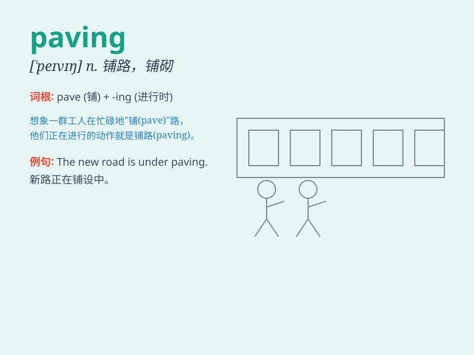

## paving

**英音:** _[\'peɪvɪŋ]_ **美音:** _[\'pevɪŋ]_

**译义:** *n.块石面路*

### 短语

+ **paving stone:** _铺路石_

+ **paving slab:** _铺地砖_

+ **paving contractor:** _铺路承包商_

+ **paving material:** _铺路材料_

+ **paving brick:** _铺路砖_

### 例句

#### 例句1

> **The paving of the new road was completed last week.**

**中文翻译:** 新道路的铺设已于上周完成。

**单词释义:** 铺设（道路等的）材料

#### 例句2

> **The workers were busy with the paving of the courtyard.**

**中文翻译:** 工人们正忙着给庭院铺路。

**单词释义:** 铺设

#### 例句3

> **The quality of the paving needs to be inspected carefully.**

**中文翻译:** 铺装质量需要仔细检查。

**单词释义:** 铺设

### 背诵小故事

> One day, I was walking on the street and saw workers busy with
paving. They were laying new stones to make the road smooth and
beautiful. The paving work was not easy, but they were very careful.

**有一天，我走在街上，看到工人正忙着铺设。他们在铺设新的石头，让道路变得平坦又漂亮。铺设工作并不容易，但他们非常仔细。**

### 图义

