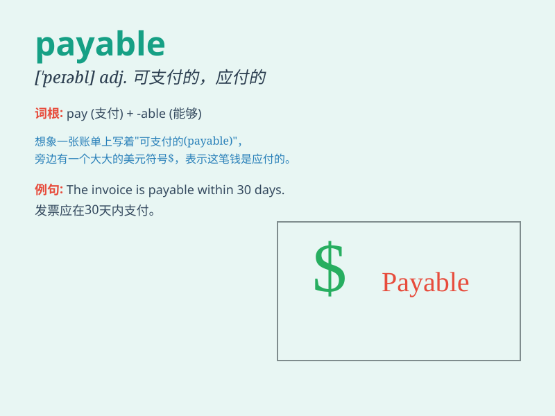

## payable

**英音:** _[\'peɪəb(ə)l]_ **美音:** _[\'peəbl]_

**译义:** *adj.可付的,应付的*

### 短语

+ **account payable:** _应付账款_

+ **notes payable:** _应付票据_

+ **tax payable:** _应付税款_

+ **dividend payable:** _应付股利_

+ **salary payable:** _应付工资_

### 例句

#### 例句1

> **The invoice is payable within 30 days.**

**中文翻译:** 发票需在 30 天内支付。

**单词释义:** 应支付的

#### 例句2

> **The loan is payable in monthly installments.**

**中文翻译:** 贷款按月分期付款。

**单词释义:** 可支付的

#### 例句3

> **The salary is payable at the end of the month.**

**中文翻译:** 工资月底发。

**单词释义:** 应付的

### 背诵小故事

> A company was in trouble because it had many payable debts. The boss
worked hard to earn money to make all the debts payable. Finally, they
paid everything and became successful.

**一家公司陷入困境，因为有许多应付款项。老板努力赚钱以使所有债务能够支付。最终，他们付清了一切，取得了成功。**

### 图义

