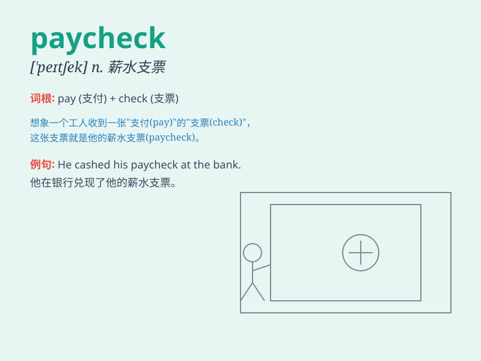

## paycheck

**英音:** _[\'peɪtʃek]_ **美音:** _[\'pe,tʃɛk]_

**译义:** *n.付薪水的支票,薪水*

### 短语

+ **collect paycheck:** _领取薪水_

+ **expect a paycheck:** _期待薪水_

+ **depend on paycheck:** _依靠薪水_

+ **receive a paycheck:** _收到薪水_

+ **cash the paycheck:** _兑现薪水支票_

### 例句

#### 例句1

> **I\'m always happy to receive my paycheck at the end of the
month.**

**中文翻译:** 我总是很高兴在月底收到薪水。

**单词释义:** 薪水支票

#### 例句2

> **He spent his entire paycheck on a new video game console.**

**中文翻译:** 他把全部薪水都花在了一台新的视频游戏机上。

**单词释义:** 薪水支票

#### 例句3

> **After working hard for weeks, she finally got her long-awaited
paycheck.**

**中文翻译:** 经过几周的努力，她终于拿到了期待已久的薪水。

**单词释义:** 薪水支票

### 背诵小故事

> One day, Tom was very happy because he received a paycheck. With the
money from the paycheck, he could buy the toys he wanted for a long
time. It was the fruit of his hard work.

**有一天，汤姆非常高兴，因为他收到了一张工资支票。凭借工资支票里的钱，他能够买到渴望已久的玩具。这是他辛勤工作的成果。**

### 图义

