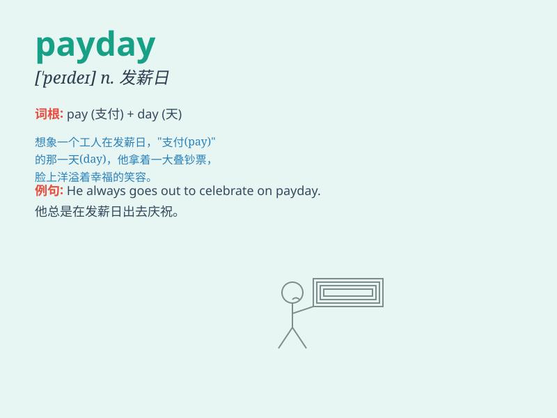

## payday

**英音:** _[ˈpeɪdeɪ]_ **美音:** _[ˈpeɪdeɪ]_

**译义:** *n.发工资日*

### 短语

+ **payday loan:** _发薪日贷款_

+ **payday advance:** _发薪日预支_

+ **payday lender:** _发薪日贷款提供者_

+ **payday Friday:** _发薪星期五_

+ **near payday:** _临近发薪日_

### 例句

#### 例句1

> **I always look forward to payday because I can pay my bills.**

**中文翻译:** 我总是期待发薪日，因为我可以支付账单。

**单词释义:** 发薪日

#### 例句2

> **Payday is the happiest day of the month for many workers.**

**中文翻译:** 对于许多工人来说，发薪日是一个月中最快乐的一天。

**单词释义:** 发薪日

#### 例句3

> **He has been counting down the days until payday.**

**中文翻译:** 他一直在倒数发薪日的日子。

**单词释义:** 发薪日

### 背诵小故事

> One day, Tom was very happy because it was payday. He had worked hard
for a month and finally got the money he deserved. With the money, he
could buy the things he wanted and enjoy a good life.

**有一天，汤姆非常高兴，因为是发薪日。他辛苦工作了一个月，终于得到了应得的钱。有了这笔钱，他可以买自己想要的东西，享受美好生活。**

### 图义

