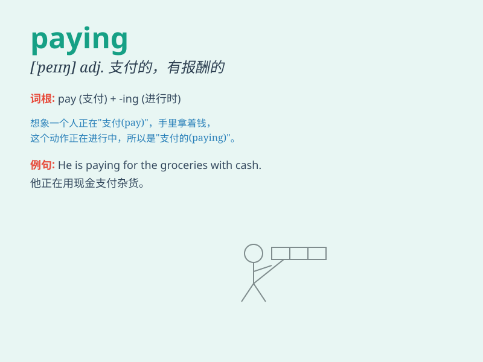

## paying

**英音:** _[\'peɪ\'ŋ]_ **美音:** _[pe]_

**译义:** *adj.支付的,有利的n.付,支付*

### 短语

+ **paying attention:** _注意；留意_

+ **paying guest:** _（在别人家付费住宿的）寄宿者_

+ **paying job:** _有报酬的工作_

+ **paying customer:** _付费客户_

+ **paying off:** _偿清；还清（债务）；取得成功_

### 例句

#### 例句1

> **I\'m paying for the meal.**

**中文翻译:** 我付饭钱。

**单词释义:** 支付

#### 例句2

> **She has been paying attention to her studies lately.**

**中文翻译:** 她最近一直很注意自己的学习。

**单词释义:** 关注

#### 例句3

> **Paying taxes is a citizen\'s responsibility.**

**中文翻译:** 纳税是公民的责任。

**单词释义:** 缴纳

### 背诵小故事

> One day, Tom was very happy because he got a job. The best part was
that the job was paying well. He could finally buy the things he wanted
and save money for his future.

**一天，汤姆非常高兴，因为他得到了一份工作。最棒的是这份工作报酬丰厚。他终于能买自己想要的东西，并为未来存钱了。**

### 图义

