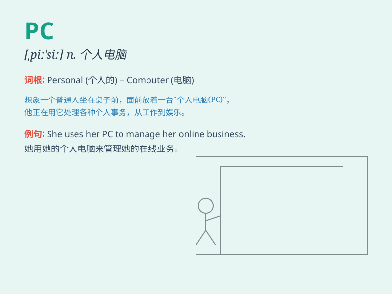

## PC

**英音:** _[ˌpiː ˈsiː]_ **美音:** _[ˌpiː ˈsiː]_

**译义:** *n.个人计算机；abbr. 政治思想正确（=politically
correct）*

### 短语

+ **PC game:** _电脑游戏_

+ **PC monitor:** _电脑显示器_

+ **PC component:** _电脑组件_

+ **PC software:** _电脑软件_

+ **PC accessory:** _电脑配件_

### 例句

#### 例句1

> **I use my PC to work from home.**

**中文翻译:** 我用我的电脑在家工作。

**单词释义:** 个人电脑

#### 例句2

> **The new game requires a powerful PC to run smoothly.**

**中文翻译:** 这款新游戏需要一台强大的个人电脑才能流畅运行。

**单词释义:** 个人电脑

#### 例句3

> **He spent a lot of money upgrading his PC.**

**中文翻译:** 他花了很多钱升级他的电脑。

**单词释义:** 个人电脑

### 背诵小故事

> 想象一下，有个聪明的程序员，他每天都坐在办公桌前对着他的 Personal
Computer（PC）敲代码。这台 PC
就像他的魔法盒子，能实现各种奇妙的想法，帮助他创造出令人惊叹的程序。

**想象一位程序员坐在办公桌前对着个人电脑敲代码，这台电脑像魔法盒子，能助他创造程序。**

### 图义

