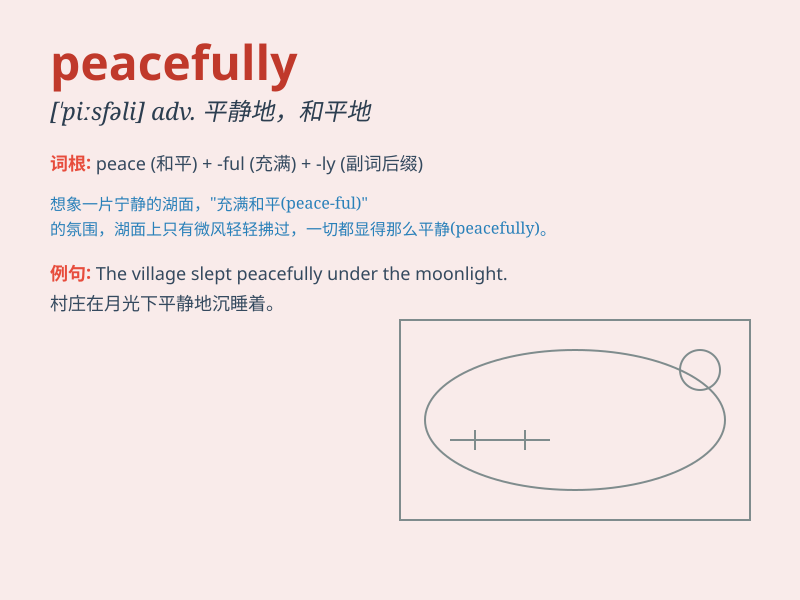

## peacefully

**英音:** _[ˈpiːs.fə.li]_ **美音:** _[ˈpis.fəl.i]_

**译义:** *adv.和平地；宁静地；平静地*

### 短语

+ **live peacefully:** _和平地生活_

+ **sleep peacefully:** _安静地入睡_

+ **pass away peacefully:** _安详地去世_

+ **rest peacefully:** _平静地休息_

+ **settle peacefully:** _和平解决_

### 例句

#### 例句1

> **The old man passed away peacefully in his sleep.**

**中文翻译:** 这位老人在睡梦中安详地去世了。

**单词释义:** 安详地；平静地

#### 例句2

> **They lived peacefully in the countryside.**

**中文翻译:** 他们在乡下平静地生活着。

**单词释义:** 平静地；安宁地

#### 例句3

> **The demonstration ended peacefully without any violence.**

**中文翻译:** 示威活动和平结束，没有任何暴力行为。

**单词释义:** 和平地；平和地

### 背诵小故事

> A little bird flew peacefully through the forest. It sang a sweet
song and enjoyed the quiet and calm. No one disturbed it. It felt so
peaceful and happy.

**一只小鸟平静地飞过森林。它唱着甜美的歌，享受着安静和平静。没有人打扰它。它感到非常宁静和快乐。**

### 图义

