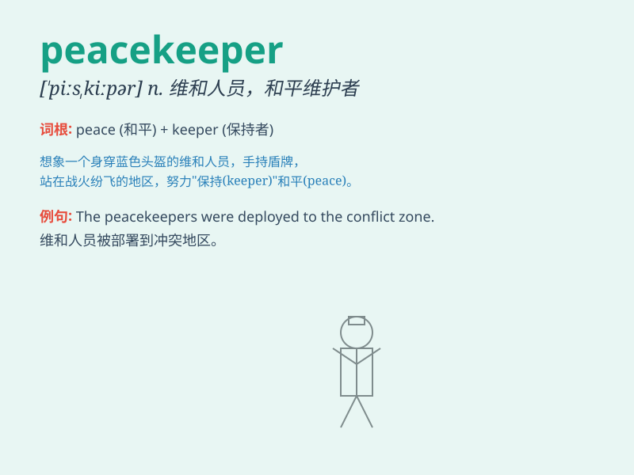

## peacekeeper

**英音:** _[\'piːs,kiːpə]_ **美音:** _[\'piskipɚ]_

**译义:** *n.(交战国间的)停火执行者(或小组)*

### 短语

+ **international peacekeeper:** _国际维和人员_

+ **UN peacekeeper:** _联合国维和人员_

+ **military peacekeeper:** _军事维和人员_

+ **peacekeeper mission:** _维和任务_

+ **peacekeeper force:** _维和部队_

### 例句

#### 例句1

> **The UN peacekeepers were deployed to the conflict zone to
maintain peace.**

**中文翻译:** 联合国维和人员被派往冲突地区维护和平。

**单词释义:** 维和人员

#### 例句2

> **He was proud to serve as a peacekeeper in the international
mission.**

**中文翻译:** 他为能够在国际特派团中担任维和人员而感到自豪。

**单词释义:** 维和人员

#### 例句3

> **The peacekeepers faced many challenges but remained committed to
their duty.**

**中文翻译:** 维和人员面临诸多挑战，但仍坚守岗位。

**单词释义:** 维和人员

### 背诵小故事

> In a war-torn land, chaos reigned. But then came the peacekeeper, a
brave figure who brought calm and order. With a smile and a kind heart,
they resolved conflicts and made everyone believe in peace again.

**在一个饱受战争蹂躏的土地上，混乱肆虐。但随后出现了维和人员，一个勇敢的人物，带来了平静和秩序。带着微笑和善良的心，他们解决了冲突，让每个人再次相信和平。**

### 图义

