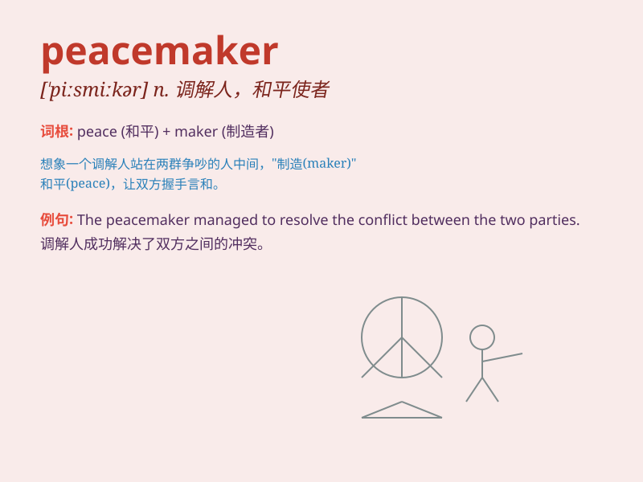

## peacemaker

**英音:** _[ˈpi:smeɪkə(r)]_ **美音:** _[ˈpisˌmekɚ]_

**译义:** *n.调解者,和事佬*

### 短语

+ **become a peacemaker:** _成为一个调解人_

+ **effective peacemaker:** _有效的调解人_

+ **skilled peacemaker:** _熟练的调解人_

+ **prominent peacemaker:** _杰出的调解人_

+ **experienced peacemaker:** _经验丰富的调解人_

### 例句

#### 例句1

> **The diplomat was seen as a peacemaker in the international
conflict.**

**中文翻译:** 这位外交官被视为国际冲突中的和平缔造者。

**单词释义:** 和平缔造者

#### 例句2

> **She has always tried to be a peacemaker among her friends when
they argue.**

**中文翻译:** 当朋友们发生争吵时，她总是试图成为他们的和事佬。

**单词释义:** 调解人

#### 例句3

> **The community leader is known as a reliable peacemaker in local
disputes.**

**中文翻译:** 社区领袖被认为是当地纠纷中可靠的和平缔造者。

**单词释义:** 和平维护者

### 背诵小故事

> In a war-torn land, there was chaos everywhere. But a brave person
emerged, determined to bring peace. This person was known as the
peacemaker. They talked to both sides, finding common ground and finally
ended the conflict.

**在一个饱受战争蹂躏的地方，到处都是混乱。但出现了一个勇敢的人，决心带来和平。这个人被称为和平使者。他们与双方交谈，找到共同点，最终结束了冲突。**

### 图义

