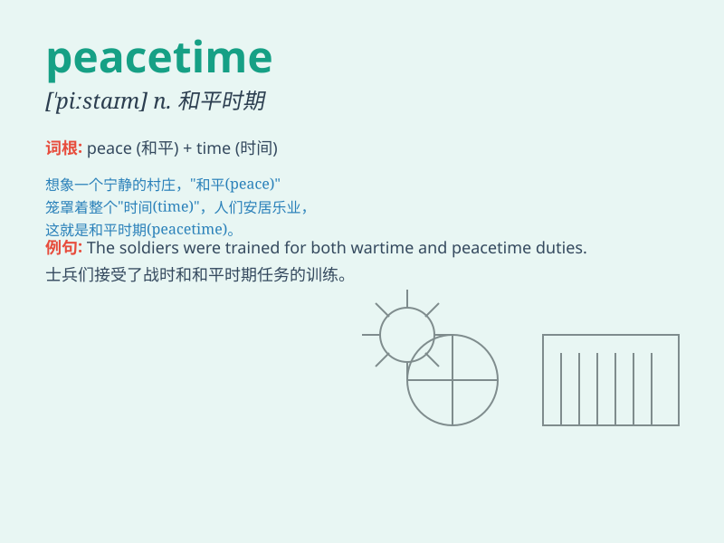

## peacetime

**英音:** _[\'piːstaɪm]_ **美音:** _[\'pis\'taɪm]_

**译义:** *n.平时,和平时期*

### 短语

+ **peacetime economy:** _和平时期的经济_

+ **peacetime activities:** _和平时期的活动_

+ **peacetime conditions:** _和平时期的状况_

+ **peacetime military:** _和平时期的军队_

+ **peacetime regime:** _和平时期的政权_

### 例句

#### 例句1

> **During peacetime, the country focused on economic
development.**

**中文翻译:** 和平时期，国家注重经济发展。

**单词释义:** 和平时期

#### 例句2

> **The military\'s role changes in peacetime.**

**中文翻译:** 和平时期军队的角色发生了变化。

**单词释义:** 和平时期

#### 例句3

> **Peacetime allows for more cultural exchanges between nations.**

**中文翻译:** 和平时期，各国之间有更多的文化交流。

**单词释义:** 和平时期

### 背诵小故事

> In peacetime, a small village was peaceful and quiet. People worked
happily in the fields and children played joyfully. There was no war or
conflict, and everyone lived a harmonious life.

**在和平时期，一个小村庄宁静祥和。人们在田间快乐地劳作，孩子们欢快地玩耍。没有战争或冲突，每个人都过着和谐的生活。**

### 图义

