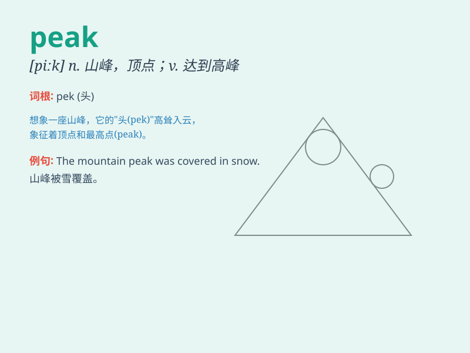

## peak

**英音:** _[piːk]_ **美音:** _[pik]_

**译义:**
*n.山顶,顶点,帽舌,(记录的)最高峰adj.最高的vi.到达最高点,消瘦,缩小vt.使竖起,使达到最高点*

### 短语

+ **peak season:** _旺季；高峰期_

+ **peak time:** _高峰时间；巅峰时刻_

+ **mountain peak:** _山峰_

+ **peak performance:** _最佳性能；巅峰表现_

+ **peak value:** _峰值；最大值_

### 例句

#### 例句1

> **The peak of the mountain was covered in snow.**

**中文翻译:** 这座山的山顶被雪覆盖着。

**单词释义:** 山顶

#### 例句2

> **Traffic reaches its peak during the rush hour.**

**中文翻译:** 交通在高峰时段达到峰值。

**单词释义:** 峰值；高峰

#### 例句3

> **She was at the peak of her career when she won the award.**

**中文翻译:** 她获奖时正处于事业的巅峰。

**单词释义:** 巅峰；顶点

### 背诵小故事

> A brave climber reached the peak of the mountain after a long and
difficult journey. Standing there, he saw the most beautiful view. The
peak was the highest point and the end of his hard effort.

**一位勇敢的登山者经过漫长而艰难的旅程到达了山顶。站在那里，他看到了最美的景色。山顶是最高的点，也是他努力的终点。**

### 图义

