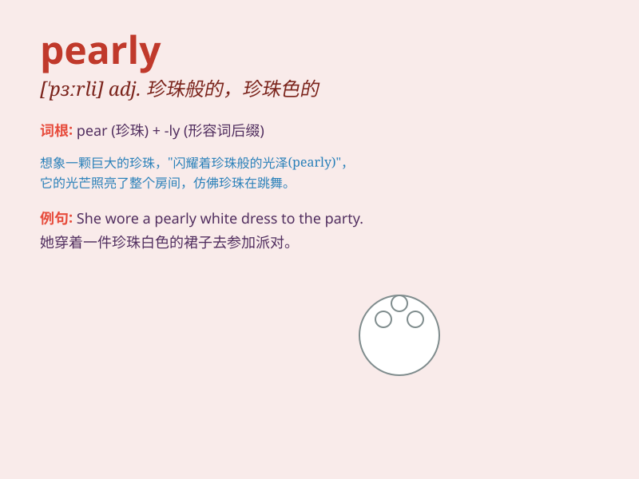

## pearly

**英音:** _[\'pɜːlɪ]_ **美音:** _[\'pɝli]_

**译义:** *adj.珍珠似的,用珍珠装饰的*

### 短语

+ **pearly gates:** _天国之门；珍珠门（常被描绘为天堂的入口）_

+ **pearly white:** _珍珠白；洁白的_

+ **pearly teeth:** _珍珠般的牙齿；洁白的牙齿_

+ **pearly shell:** _珍珠贝壳_

+ **pearly complexion:** _珍珠般的肤色；白皙的肤色_

### 例句

#### 例句1

> **She wore a pearly necklace that sparkled in the light.**

**中文翻译:** 她戴着一条在灯光下闪闪发光的珍珠项链。

**单词释义:** 珍珠般的；像珍珠的（形容项链的质地或外观）

#### 例句2

> **The morning dew made the grass look pearly.**

**中文翻译:** 早晨的露水使草看起来像珍珠般晶莹。

**单词释义:** 珍珠般的（形容露水使草呈现的样子）

#### 例句3

> **Her pearly smile lit up the room.**

**中文翻译:** 她那珍珠般的微笑照亮了房间。

**单词释义:** 珍珠般的（形容微笑的美好）

### 背诵小故事

> A girl named Lily found a magical pearl in the ocean. The pearl had a
pearly luster that shone so brightly. It made Lily\'s eyes sparkle like
stars. From then on, she always remembered the word \'pearly\' when
thinking of that beautiful pearl.

**一个叫莉莉的女孩在海洋里发现了一颗神奇的珍珠。这颗珍珠有着珍珠般的光泽，闪耀得如此明亮。它让莉莉的眼睛像星星一样闪闪发光。从那以后，当她想到那颗美丽的珍珠时，总是记得'pearly'这个词。**

### 图义

