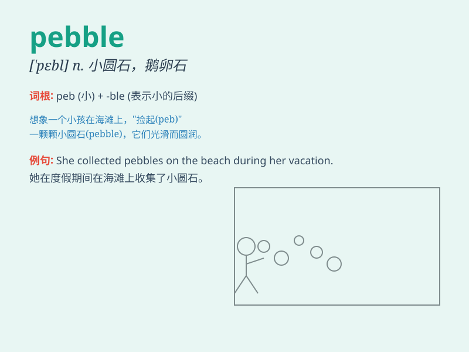

## pebble

**英音:** _[\'peb(ə)l]_ **美音:** _[\'pɛbl]_

**译义:** *n.小圆石,小鹅卵石*

### 短语

+ **pebble beach:** _卵石海滩_

+ **smooth pebble:** _光滑的卵石_

+ **round pebble:** _圆形的卵石_

+ **colored pebble:** _彩色的卵石_

+ **throw a pebble:** _扔一块卵石_

### 例句

#### 例句1

> **I picked up a smooth pebble on the beach.**

**中文翻译:** 我在海滩上捡起了一块光滑的卵石。

**单词释义:** 卵石

#### 例句2

> **The path was covered with pebbles.**

**中文翻译:** 这条小路铺满了卵石。

**单词释义:** 卵石

#### 例句3

> **He threw a pebble into the pond and watched the ripples
spread.**

**中文翻译:** 他把一块卵石扔进池塘，看着涟漪扩散开来。

**单词释义:** 卵石

### 背诵小故事

> A little boy was walking along the river. Suddenly, he saw a shiny
pebble. It was so smooth and round. He picked it up and decided to keep
it as a lucky charm.

**一个小男孩沿着河边走。突然，他看到了一块闪闪发光的卵石。它又光滑又圆。他捡起它并决定把它当作幸运符保存起来。**

### 图义

