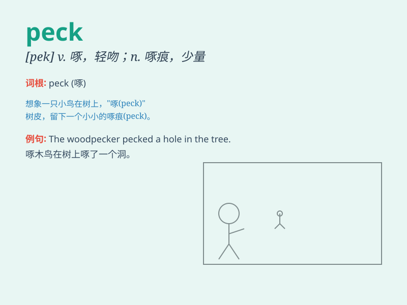

## peck

**英音:** _[pek]_ **美音:** _[pɛk]_

**译义:**
*n.啄痕,许多,配克(容量单位,等于2加仑)vt.啄食,扔vi.啄,吹毛求疵,啄食,扔石头v.\<口>吃一点点*

### 短语

+ **peck at:** _啄；少量地吃_

+ **peck out:** _啄出_

+ **a peck of:** _许多；大量_

+ **peck up:** _振作起来；捡起_

+ **give someone a peck:** _轻吻某人_

### 例句

#### 例句1

> **The chicken pecked at the grains on the ground.**

**中文翻译:** 鸡啄食地上的谷物。

**单词释义:** 啄

#### 例句2

> **She gave him a peck on the cheek.**

**中文翻译:** 她在他脸颊上轻吻了一下。

**单词释义:** 轻吻

#### 例句3

> **The woodpecker pecked holes in the tree trunk.**

**中文翻译:** 啄木鸟在树干上啄了洞。

**单词释义:** 啄

### 背诵小故事

> A little bird was hungry. It pecked at the tree trunk again and again
to find bugs. Finally, it got enough food. Remember, \'peck\' means to
strike or bite something quickly and repeatedly.

**一只小鸟饿了。它一次又一次地啄树干以寻找虫子。最后，它获得了足够的食物。记住，'peck'意思是快速且反复地撞击或啄某物。**

### 图义

