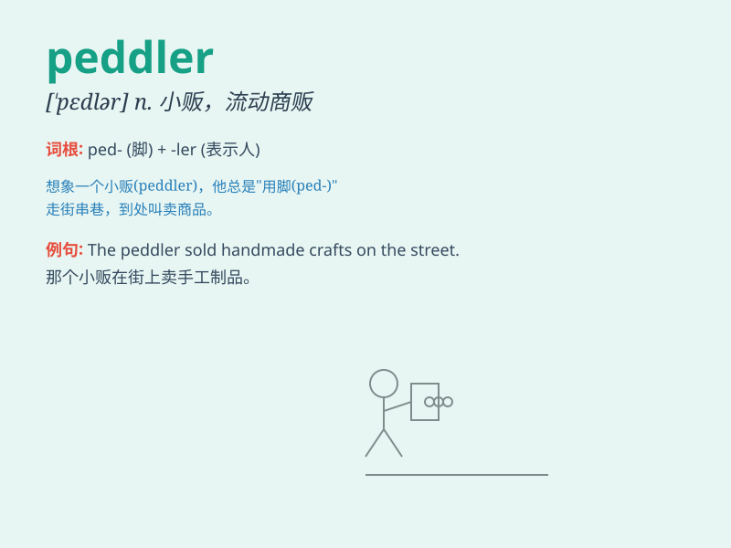

## peddler

**英音:** _[\'pedlə]_ **美音:** _[\'pɛdlɚ]_

**译义:** *n.小贩,传播者*

### 短语

+ **street peddler:** _街头小贩_

+ **book peddler:** _书贩_

+ **drug peddler:** _毒贩_

+ **information peddler:** _信息贩子_

+ **illegal peddler:** _非法小贩_

### 例句

#### 例句1

> **The peddler was selling trinkets on the street corner.**

**中文翻译:** 小贩在街角卖小饰品。

**单词释义:** 小贩

#### 例句2

> **We should be cautious when dealing with peddlers to avoid being
cheated.**

**中文翻译:** 我们在与小贩打交道时要小心谨慎，避免上当受骗。

**单词释义:** 小贩

#### 例句3

> **The peddler\'s goods were of poor quality.**

**中文翻译:** 小贩的货物质量很差。

**单词释义:** 小贩

### 背诵小故事

> One day, a poor man was walking on the street. Suddenly, he saw a
peddler selling all kinds of strange items. The peddler was shouting
loudly to attract customers. The poor man was curious and went closer to
have a look.

**有一天，一个穷人走在街上。突然，他看到一个小贩在售卖各种各样奇怪的物品。这个小贩大声吆喝着吸引顾客。穷人很好奇，便走近去看一看。**

### 图义

