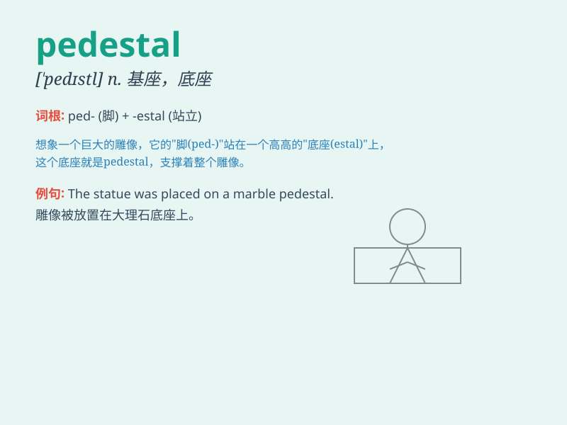

## pedestal

**英音:** _[\'pedɪst(ə)l]_ **美音:** _[\'pɛdɪstl]_

**译义:** *n.基架,底座,基础vt.加座,搁在台上,支持*

### 短语

+ **put on a pedestal:** _崇拜；过分看重_

+ **knock someone off their pedestal:** _使某人不再受崇拜_

+ **pedestal basin:** _立柱式面盆_

+ **pedestal table:** _台座式桌子_

+ **pedestal fan:** _台扇_

### 例句

#### 例句1

> **The statue stands on a tall pedestal.**

**中文翻译:** 雕像矗立在高高的基座上。

**单词释义:** 基座；底座

#### 例句2

> **He put his wife on a pedestal and treated her like a queen.**

**中文翻译:** 他把自己的妻子捧为王后，待她如女王一般。

**单词释义:** 受人尊敬的地位

#### 例句3

> **The athlete was knocked off her pedestal after the doping
scandal.**

**中文翻译:** 在兴奋剂丑闻之后，这位运动员被从神坛上赶了下来。

**单词释义:** 受人尊敬的地位

### 背诵小故事

> A brave knight climbed onto a pedestal to look far into the distance
and protect the village. The pedestal was so high and stable. It became
a symbol of his watchfulness. Remember, pedestal means a base or
support.

**一位勇敢的骑士爬上一个基座向远处眺望以保卫村庄。这个基座又高又稳。它成为了他警惕性的象征。记住，pedestal
意思是基座或底座。**

### 图义

