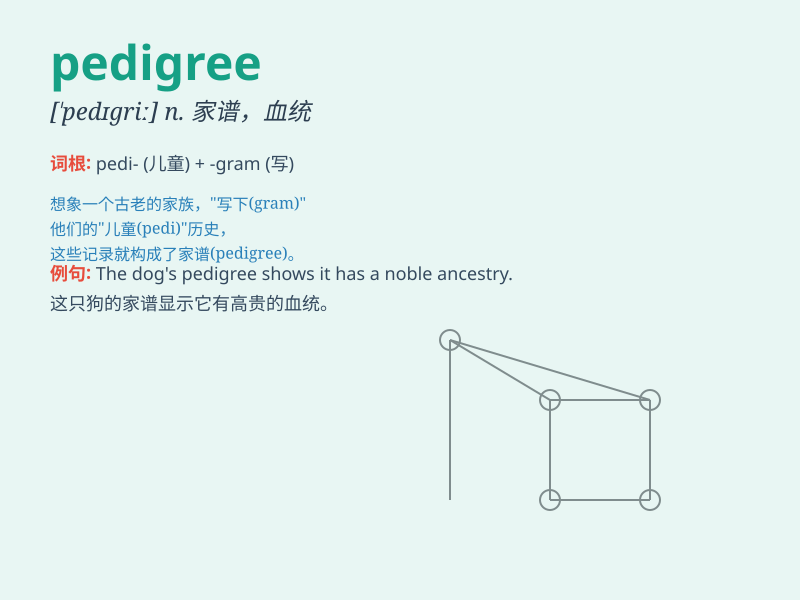

## pedigree

**英音:** _[\'pedɪgriː]_ **美音:** _[\'pɛdɪɡri]_

**译义:** *n.血统,家谱*

### 短语

+ **pedigree chart:** _系谱图；家谱图_

+ **pedigree dog:** _纯种狗_

+ **pedigree breeding:** _纯种繁殖_

+ **pedigree analysis:** _系谱分析；家系分析_

+ **pedigree record:** _系谱记录；血统记录_

### 例句

#### 例句1

> **The dog has an excellent pedigree.**

**中文翻译:** 该犬具有优良的血统。

**单词释义:** 血统；家谱

#### 例句2

> **She was proud of her family\'s pedigree.**

**中文翻译:** 她为自己家族的血统感到自豪。

**单词释义:** 世系；门第

#### 例句3

> **The horse\'s pedigree indicated its potential for success in
races.**

**中文翻译:** 这匹马的血统表明了它在比赛中取得成功的潜力。

**单词释义:** （动物的）血统

### 背诵小故事

> A young puppy was lost. To find its home, people checked its
pedigree. It showed the puppy came from a noble line of dogs. With this
clue, they finally reunited the puppy with its owner.

**一只小狗走丢了。为了帮它找到家，人们查看了它的血统证明。证明显示这只小狗来自高贵的犬种血统。凭借这个线索，他们最终让小狗与主人团聚。**

### 图义

