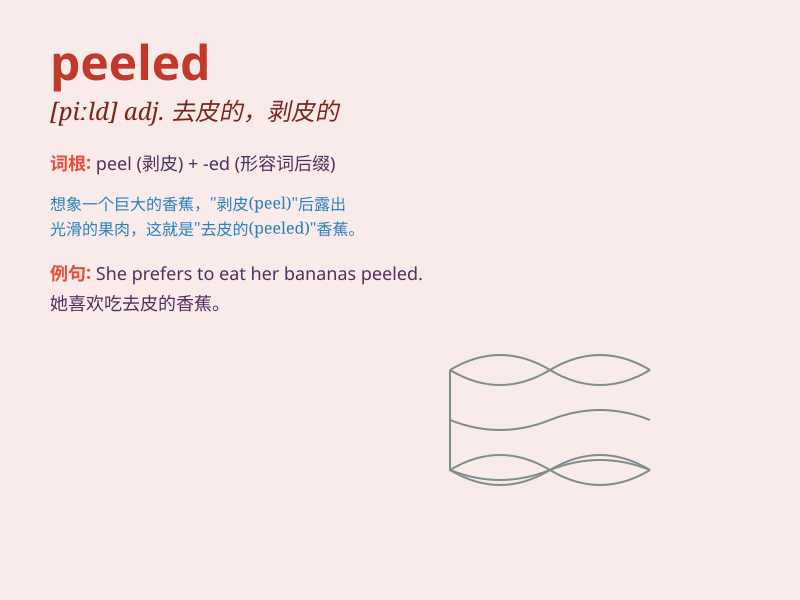

## peeled

**英音:** _[piːld]_ **美音:** _[pid]_

**译义:** *adj. 去皮的，剥皮的；剥落的；脱皮的；剥离的 v.
剥皮（peel的过去式和过去分词）*

### 短语

+ **peeled off:** _剥落；脱落；脱去_

+ **peeled fruit:** _去皮的水果_

+ **peeled potatoes:** _去皮的土豆_

+ **peeled prawns:** _去皮的虾_

+ **peeled garlic:** _去皮的大蒜_

### 例句

#### 例句1

> **I peeled the banana and ate it.**

**中文翻译:** 我剥了香蕉并吃了它。

**单词释义:** 剥（皮）

#### 例句2

> **She peeled the potatoes for dinner.**

**中文翻译:** 她为晚餐削了土豆皮。

**单词释义:** 削（皮）

#### 例句3

> **He carefully peeled the label off the bottle.**

**中文翻译:** 他小心地把瓶子上的标签撕下来。

**单词释义:** 撕下，剥掉

### 背诵小故事

> One day, I was in the kitchen. I took an orange and peeled its skin
carefully. The peeled orange looked so juicy and inviting. It made me
feel happy and satisfied.

**有一天，我在厨房。我拿了一个橙子，小心地剥掉它的皮。被剥了皮的橙子看起来多汁又诱人。这让我感到开心和满足。**

### 图义

