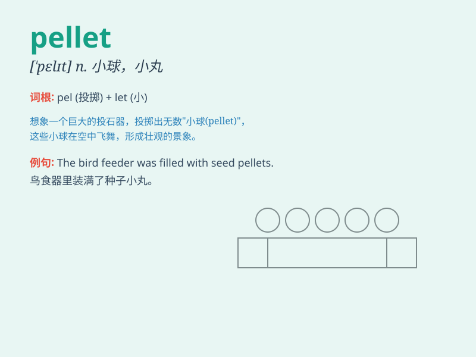

## pellet

**英音:** _[\'pelɪt]_ **美音:** _[\'pɛlɪt]_

**译义:** *n.小球*

### 短语

+ **lead pellet:** _铅粒_

+ **wood pellet:** _木质颗粒_

+ **pellet stove:** _颗粒炉_

+ **pellet gun:** _气枪_

+ **feed pellet:** _饲料颗粒_

### 例句

#### 例句1

> **The bird pecked at the pellet of food.**

**中文翻译:** 那只鸟啄食了食物颗粒。

**单词释义:** 小团；小球状物（指食物）

#### 例句2

> **The hunter fired a pellet at the rabbit.**

**中文翻译:** 猎人向兔子发射了一颗子弹。

**单词释义:** 弹丸；子弹

#### 例句3

> **The wood pellet is a kind of new energy source.**

**中文翻译:** 木屑颗粒是一种新能源。

**单词释义:** 颗粒

### 背诵小故事

> A hungry little rabbit was looking for food. Suddenly, it found some
pellet-shaped carrots. They were small and cute. The rabbit happily ate
them and felt full. Remember, pellet means a small, round piece of
something.

**一只饥饿的小兔子正在寻找食物。突然，它发现了一些颗粒状的胡萝卜。它们又小又可爱。小兔子高兴地吃了它们，感觉饱了。记住，pellet
意思是小的、圆形的物体。**

### 图义

