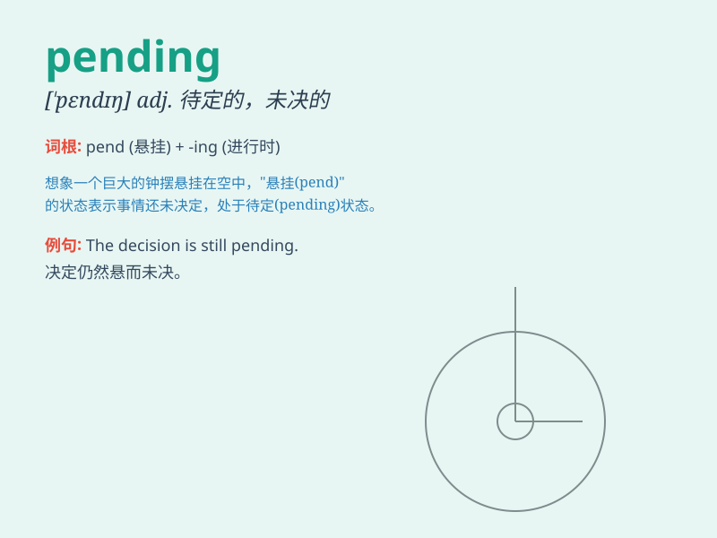

## pending

**英音:** _[\'pendɪŋ]_ **美音:** _[\'pɛndɪŋ]_

**译义:** *adj.未决的*

### 短语

+ **pending approval:** _等待批准_

+ **pending decision:** _悬而未决的决定_

+ **pending investigation:** _正在调查中_

+ **pending matters:** _未决事项_

+ **pending transaction:** _未完成的交易_

### 例句

#### 例句1

> **The lawsuit is still pending.**

**中文翻译:** 该诉讼仍在审理中。

**单词释义:** 未决的；待定的

#### 例句2

> **We have to wait pending further instructions.**

**中文翻译:** 我们必须等待进一步的指示。

**单词释义:** 直到；在等待...期间

#### 例句3

> **The matter is pending investigation.**

**中文翻译:** 此事正在等待调查。

**单词释义:** 悬而未决的；待处理的

### 背诵小故事

> A detective was working on a case. The verdict was pending. It was
like waiting for a key to unlock a mystery box. The tension grew as the
days passed, but the answer was still pending.

**一位侦探正在办理一个案子。裁决结果尚未确定。这就像等待一把解开神秘盒子的钥匙。日子一天天过去，紧张感加剧，但答案仍悬而未决。**

### 图义

