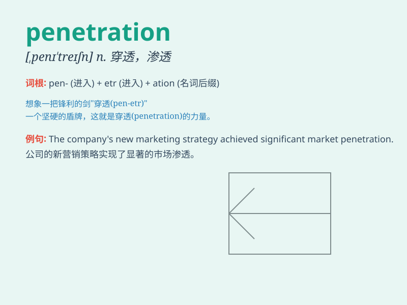

## penetration

**英音:** _[penɪ\'treɪʃ(ə)n]_ **美音:**
_[,pɛnɪ\'treʃən]_

**译义:** *n.穿过,渗透,突破*

### 短语

+ **market penetration:** _市场渗透_

+ **penetration rate:** _渗透率；穿透率_

+ **penetration test:** _渗透测试_

+ **deep penetration:** _深度穿透_

+ **penetration pricing:** _渗透定价_

### 例句

#### 例句1

> **The company\'s market penetration has increased significantly
this year.**

**中文翻译:** 今年该公司的市场渗透率显着提高。

**单词释义:** 渗透；穿透；进入

#### 例句2

> **The bullet had enough penetration to pass through the wall.**

**中文翻译:** 子弹的穿透力足以穿过墙壁。

**单词释义:** 穿透力；穿透能力

#### 例句3

> **His analysis has a deep penetration into the problem.**

**中文翻译:** 他的分析对问题的洞察很深刻。

**单词释义:** 洞察力；深入了解

### 背诵小故事

> A brave detective was on a case. He needed to find the hidden
evidence. With great effort and sharp thinking, he made a penetration
into the secret room and finally solved the mystery.

**一位勇敢的侦探在办案。他需要找到隐藏的证据。凭借巨大的努力和敏锐的思维，他成功地穿透进入了密室，最终解开了谜团。**

### 图义

