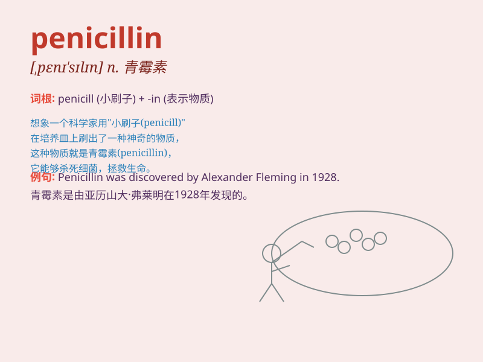

## penicillin

**英音:** _[penɪ\'sɪlɪn]_ **美音:** _[,pɛnɪ\'sɪlɪn]_

**译义:** *n.[微]青霉素(一种抗菌素,音译名为盘尼西林)*

### 短语

+ **penicillin allergy:** _青霉素过敏_

+ **penicillin injection:** _青霉素注射_

+ **penicillin resistance:** _青霉素耐药性_

+ **penicillin tablet:** _青霉素片_

+ **penicillin treatment:** _青霉素治疗_

### 例句

#### 例句1

> **The doctor prescribed penicillin to treat my infection.**

**中文翻译:** 医生给我开了青霉素来治疗我的感染。

**单词释义:** 青霉素（一种用于治疗感染的药物）

#### 例句2

> **I\'m allergic to penicillin, so the doctor had to find an
alternative medicine.**

**中文翻译:** 我对青霉素过敏，所以医生不得不寻找替代药物。

**单词释义:** 青霉素

#### 例句3

> **Penicillin was a revolutionary discovery in the field of
medicine.**

**中文翻译:** 青霉素是医学领域的革命性发现。

**单词释义:** 青霉素

### 背诵小故事

> Once upon a time, a scientist was in a pen. He discovered a special
substance that could kill bacteria. This amazing discovery was named
\'penicillin\'.

**从前，一位科学家在一支笔里。他发现了一种能杀死细菌的特殊物质。这个惊人的发现被命名为"青霉素"。**

### 图义

