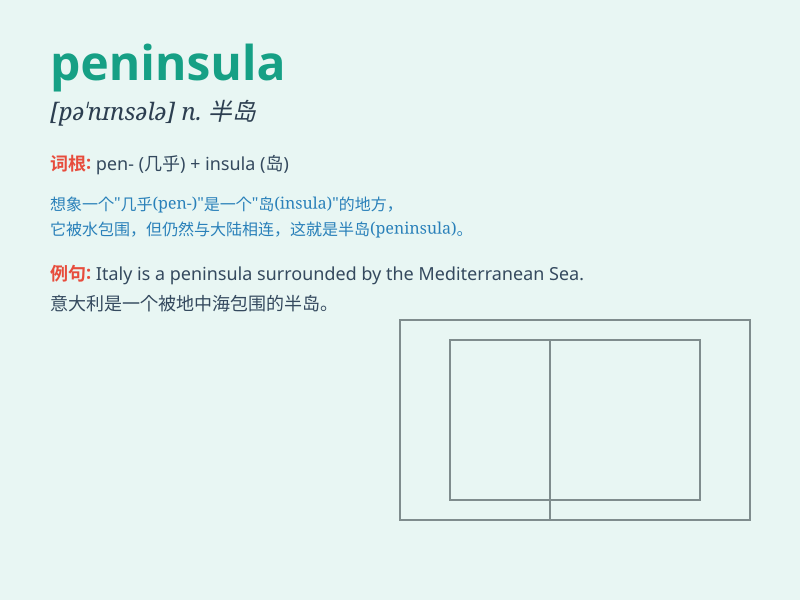

## peninsula

**英音:** _[pɪ\'nɪnsjʊlə]_ **美音:** _[pə\'nɪnsələ]_

**译义:** *n.半岛*

### 短语

+ **peninsula hotel:** _半岛酒店_

+ **arabian peninsula:** _阿拉伯半岛_

+ **iberian peninsula:** _伊比利亚半岛_

+ **indian peninsula:** _印度半岛_

+ **balkan peninsula:** _巴尔干半岛_

### 例句

#### 例句1

> **The Iberian Peninsula is known for its rich history and diverse
cultures.**

**中文翻译:** 伊比利亚半岛以其丰富的历史和多元的文化而闻名。

**单词释义:** 半岛

#### 例句2

> **The Korean Peninsula has been a focus of international attention
for many years.**

**中文翻译:** 朝鲜半岛问题多年来一直是国际社会关注的焦点。

**单词释义:** 半岛

#### 例句3

> **They went on a vacation to a beautiful peninsula in the
south.**

**中文翻译:** 他们去南方一个美丽的半岛度假。

**单词释义:** 半岛

### 背诵小故事

> A brave explorer was lost on an island. He finally discovered that it
was not a full island but a peninsula, connected to the mainland by a
narrow strip of land. He shouted, \'I found it\'s a peninsula!\'

**一位勇敢的探险家在一个岛上迷路了。他最终发现这不是一个完整的岛屿，而是一个半岛，通过一条狭窄的陆地与大陆相连。他大喊：\'我发现这是个半岛！\'**

### 图义

