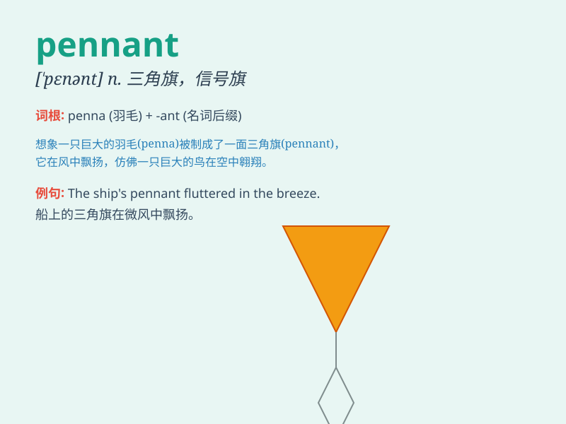

## pennant

**英音:** _[\'penənt]_ **美音:** _[\'pɛnənt]_

**译义:** *n.细长三角旗,短绳*

### 短语

+ **racing pennant:** _赛旗_

+ **warning pennant:** _警示旗_

+ **victory pennant:** _胜利旗_

+ **pennant string:** _三角旗串_

+ **pennant pole:** _三角旗旗杆_

### 例句

#### 例句1

> **The ship was flying a colorful pennant.**

**中文翻译:** 船上飘扬着五彩缤纷的三角旗。

**单词释义:** 三角旗

#### 例句2

> **The sports team carried the pennant as they entered the
stadium.**

**中文翻译:** 运动队高举锦旗入场。

**单词释义:** 队旗

#### 例句3

> **A pennant was fluttering in the wind at the top of the pole.**

**中文翻译:** 杆顶上，一面锦旗在风中飘扬。

**单词释义:** 三角旗

### 背诵小故事

> A brave sailor was on a ship. One day, a strong wind blew off the
ship\'s pennant. He risked his life to catch it because the pennant was
a symbol of their journey and honor.

**一位勇敢的水手在船上。有一天，一阵强风刮走了船上的三角旗。他冒着生命危险去抓住它，因为这面三角旗是他们旅程和荣誉的象征。**

### 图义

