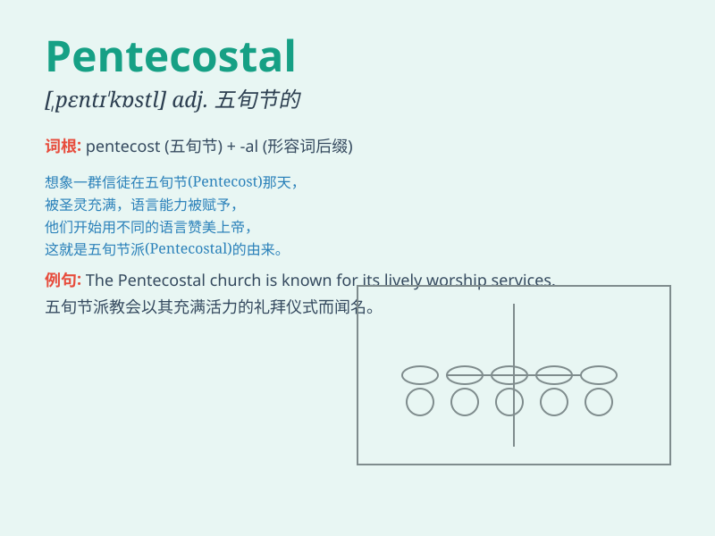

## Pentecostal

**英音:** _[ˌpɛntɪˈkɒstl]_ **美音:** _[ˌpɛntɪˈkɑːstl]_

**译义:** *adj.五旬节的；圣灵降临节的；五旬节派的
n.五旬节派教会成员*

### 短语

+ **Pentecostal church:** _五旬节派教会_

+ **Pentecostal movement:** _五旬节运动_

+ **Pentecostal theology:** _五旬节神学_

+ **Pentecostal experience:** _五旬节经历_

+ **Pentecostal worship:** _五旬节崇拜_

### 例句

#### 例句1

> **The Pentecostal church attracts many devoted followers.**

**中文翻译:** 五旬节派教会吸引了许多虔诚的追随者。

**单词释义:** 五旬节派的

#### 例句2

> **She is deeply involved in Pentecostal worship.**

**中文翻译:** 她深深地投入到五旬节派的崇拜中。

**单词释义:** 五旬节派的

#### 例句3

> **The Pentecostal movement has grown rapidly in recent years.**

**中文翻译:** 近年来，五旬节运动发展迅速。

**单词释义:** 五旬节派的

### 背诵小故事

> One day, a traveler was lost in a strange town. A Pentecostal church
caught his eye. The people inside were full of enthusiasm and spirit. He
felt the power of their faith and was deeply touched.

**有一天，一位旅行者在一个陌生的城镇迷路了。一座五旬节派的教堂吸引了他的目光。里面的人们充满热情和精神。他感受到了他们信仰的力量，深受触动。**

### 图义

