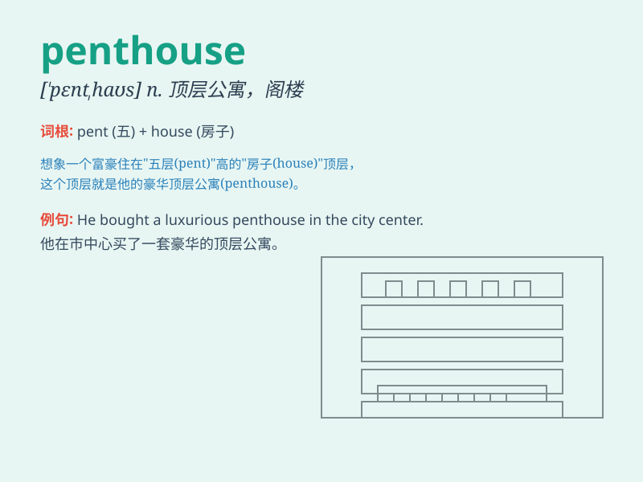

## penthouse

**英音:** _[\'penthaʊs]_ **美音:** _[\'pɛnthaʊs]_

**译义:** *n.小棚屋,雨篷*

### 短语

+ **penthouse suite:** _顶层套房_

+ **luxury penthouse:** _豪华顶层公寓_

+ **penthouse apartment:** _顶层公寓_

+ **rooftop penthouse:** _屋顶顶层公寓_

+ **modern penthouse:** _现代顶层公寓_

### 例句

#### 例句1

> **The penthouse offers breathtaking views of the city skyline.**

**中文翻译:** 顶层公寓享有城市天际线的壮丽景色。

**单词释义:** 顶层公寓

#### 例句2

> **They spent the weekend in a luxurious penthouse suite.**

**中文翻译:** 他们在豪华的顶层套房里度过了周末。

**单词释义:** 顶层套房

#### 例句3

> **The actress bought a penthouse in the heart of the city.**

**中文翻译:** 这位女演员在市中心买了一套顶层公寓。

**单词释义:** 顶层公寓

### 背诵小故事

> A poor man always dreamed of having a penthouse. One day, he won the
lottery and bought a penthouse with a great view. Now he enjoys life in
this special top-floor apartment.

**一个穷人一直梦想拥有一套顶层豪华公寓。有一天，他中了彩票，买了一套视野很棒的顶层豪华公寓。现在他在这个特别的顶楼公寓里享受生活。**

### 图义

