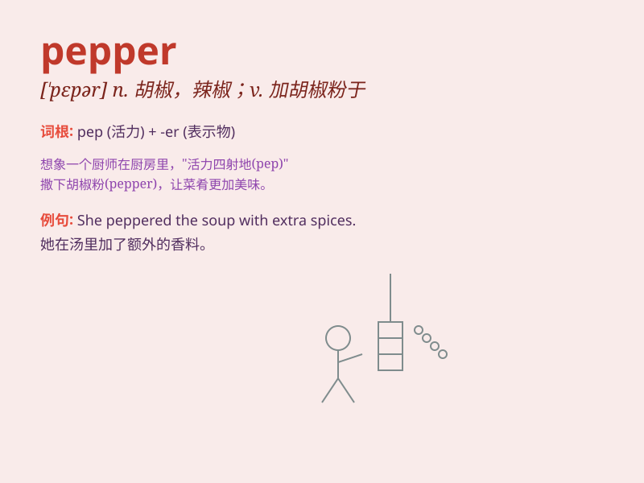

## pepper

**英音:** _[\'pepə]_ **美音:** _[\'pɛpɚ]_

**译义:** *n.胡椒粉*

### 短语

+ **black pepper:** _黑胡椒_

+ **red pepper:** _红辣椒_

+ **pepper spray:** _胡椒喷雾_

+ **pepper mill:** _胡椒研磨器_

+ **pepper pot:** _胡椒瓶_

### 例句

#### 例句1

> **The chef added some pepper to the soup to enhance the flavor.**

**中文翻译:** 厨师往汤里加了一些胡椒粉来提味。

**单词释义:** 胡椒粉

#### 例句2

> **She peppered her speech with jokes to make it more engaging.**

**中文翻译:** 她在演讲中穿插了很多笑话，使其更吸引人。

**单词释义:** 大量加入；使布满

#### 例句3

> **The thief was peppered with bullets by the police.**

**中文翻译:** 那个小偷遭到警察的一阵枪击。

**单词释义:** 向...连续射击

### 背诵小故事

> A little girl was cooking. She added too much pepper to the dish and
made everyone sneeze. But she learned that pepper can give a strong
flavor if used properly.

**一个小女孩在做饭。她往菜里加了太多的胡椒粉，让每个人都打喷嚏。但她知道了如果使用得当，胡椒粉能带来浓郁的味道。**

### 图义

