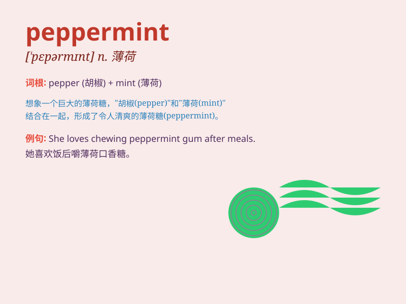

## peppermint

**英音:** _[\'pepəmɪnt]_ **美音:** _[\'pɛpɚmɪnt]_

**译义:** *n.胡椒薄荷,薄荷油*

### 短语

+ **peppermint candy:** _薄荷糖_

+ **peppermint tea:** _薄荷茶_

+ **peppermint oil:** _薄荷油_

+ **peppermint extract:** _薄荷提取物_

+ **peppermint flavor:** _薄荷味_

### 例句

#### 例句1

> **I love the taste of peppermint in my tea.**

**中文翻译:** 我喜欢我茶里薄荷的味道。

**单词释义:** 薄荷

#### 例句2

> **She chewed a piece of peppermint gum to freshen her breath.**

**中文翻译:** 她嚼了一块薄荷口香糖来清新口气。

**单词释义:** 薄荷

#### 例句3

> **The peppermint candies are very popular during Christmas.**

**中文翻译:** 薄荷糖在圣诞节期间非常受欢迎。

**单词释义:** 薄荷

### 背诵小故事

> One day, a little girl was feeling down. Her mother gave her a candy
that smelled like fresh peppermint. The cool and sweet smell made her
happy. From then on, whenever she thought of peppermint, she remembered
that happy moment.

**有一天，一个小女孩情绪低落。她的妈妈给了她一颗闻起来像新鲜薄荷的糖果。清凉甜蜜的气味让她开心起来。从那以后，每当她想到薄荷，就会想起那个快乐的时刻。**

### 图义

