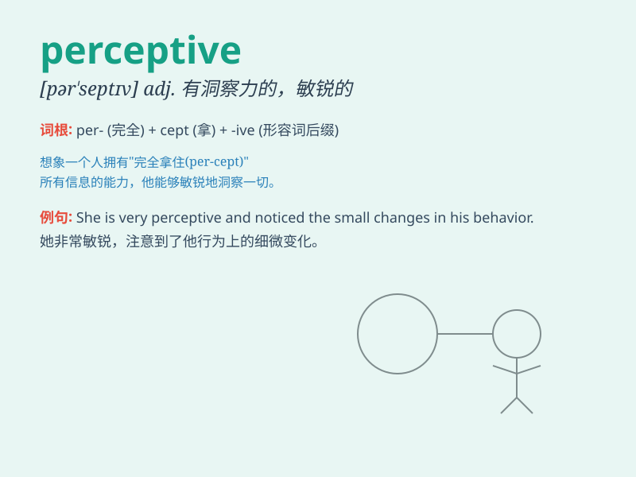

## perceptive

**英音:** _[pə\'septɪv]_ **美音:** _[pɚ\'sɛptɪv]_

**译义:** *adj.有理解的*

### 短语

+ **perceptive analysis:** _敏锐的分析_

+ **perceptive listener:** _有洞察力的听众_

+ **perceptive comment:** _有见地的评论_

+ **perceptive mind:** _敏锐的头脑_

+ **perceptive observation:** _敏锐的观察_

### 例句

#### 例句1

> **She is a perceptive reader who notices every detail in the
book.**

**中文翻译:** 她是一个敏锐的读者，能注意到书中的每一个细节。

**单词释义:** 敏锐的

#### 例句2

> **The perceptive detective was able to solve the mystery
quickly.**

**中文翻译:** 这位洞察力强的侦探能够迅速解开谜团。

**单词释义:** 有洞察力的

#### 例句3

> **His perceptive comments on the situation were highly
appreciated.**

**中文翻译:** 他对这种情况的有见地的评论受到了高度赞赏。

**单词释义:** 有见地的

### 背诵小故事

> A perceptive detective was on a case. He noticed tiny details others
missed. Like a footprint in the corner or a scratch on a wall. His
perceptive skills helped solve the mystery.

**一位有洞察力的侦探在办案。他注意到别人忽略的微小细节。比如角落里的一个脚印或者墙上的一道划痕。他的洞察力帮助解决了谜团。**

### 图义

