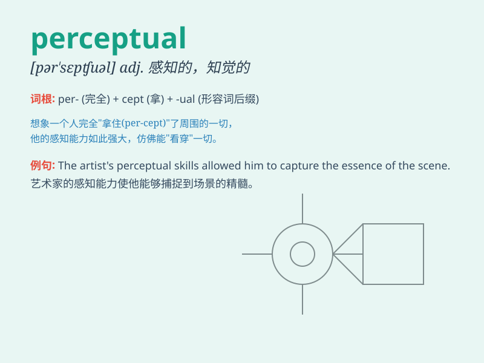

## perceptual

**英音:** _[pə\'septjʊəl]_ **美音:** _[pɚ\'sɛptʃuəl]_

**译义:** *adj.知觉的,有知觉的*

### 短语

+ **perceptual ability:** _感知能力_

+ **perceptual experience:** _感知经验_

+ **perceptual learning:** _知觉学习_

+ **perceptual processing:** _感知处理_

+ **perceptual threshold:** _知觉阈限_

### 例句

#### 例句1

> **The perceptual experience of visiting a new city can be
overwhelming.**

**中文翻译:** 参观一个新城市的感知体验可能会让人应接不暇。

**单词释义:** 感知的；知觉的

#### 例句2

> **Perceptual skills are crucial for an artist to accurately
represent the world.**

**中文翻译:** 感知技能对于艺术家准确地描绘世界至关重要。

**单词释义:** 感知的；知觉的

#### 例句3

> **The study focuses on the perceptual differences between children
and adults.**

**中文翻译:** 这项研究关注儿童和成人之间的感知差异。

**单词释义:** 感知的；知觉的

### 背诵小故事

> A detective was solving a case. He relied on his perceptual skills to
notice tiny details others missed. His sharp perceptual ability helped
him catch the criminal.

**一位侦探正在破案。他依靠自己的感知能力注意到别人错过的微小细节。他敏锐的感知能力帮助他抓住了罪犯。**

### 图义

