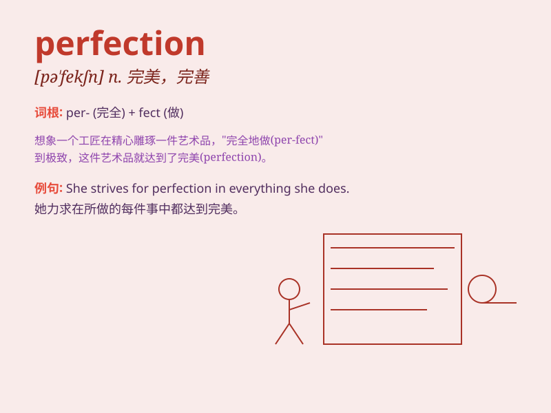

## perfection

**英音:** _[pə\'fekʃ(ə)n]_ **美音:** _[pɚ\'fɛkʃən]_

**译义:** *n.尽善尽美,完美,完成*

### 短语

+ **strive for perfection:** _力求完美_

+ **perfection of form:** _形式的完美_

+ **approach perfection:** _接近完美_

+ **attain perfection:** _达到完美_

+ **pursuit of perfection:** _对完美的追求_

### 例句

#### 例句1

> **She strives for perfection in everything she does.**

**中文翻译:** 她做任何事情都力求完美。

**单词释义:** 完美

#### 例句2

> **The artist\'s work is a masterpiece of perfection.**

**中文翻译:** 这位艺术家的作品是完美的杰作。

**单词释义:** 完美

#### 例句3

> **He has an almost obsessive pursuit of perfection.**

**中文翻译:** 他对完美有着近乎痴迷的追求。

**单词释义:** 完美

### 背诵小故事

> A young artist strived for perfection in every stroke of his
painting. He spent countless hours, refused to stop until it was
flawless. Finally, his masterpiece achieved perfection and was highly
praised.

**一位年轻的艺术家在他画作的每一笔中都力求完美。他花费了无数个小时，不达到完美绝不罢休。最终，他的杰作达到了完美境界，并受到高度赞扬。**

### 图义

