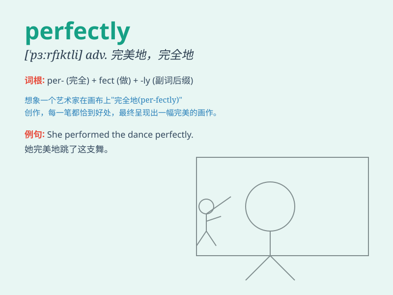

## perfectly

**英音:** _[\'pɜːfɪk(t)lɪ]_ **美音:** _[\'pɝfɪktli]_

**译义:** *adj.极佳地,完美的adv.很,完全,完美地*

### 短语

+ **perfectly clear:** _十分清楚_

+ **perfectly normal:** _完全正常_

+ **perfectly still:** _一动不动_

+ **perfectly safe:** _绝对安全_

+ **perfectly fine:** _非常好_

### 例句

#### 例句1

> **The dress fits her perfectly.**

**中文翻译:** 这条裙子非常适合她。

**单词释义:** 完全地；完美地；十分

#### 例句2

> **He performed the task perfectly.**

**中文翻译:** 他完美地完成了任务。

**单词释义:** 完美地；极好地

#### 例句3

> **The weather was perfectly lovely.**

**中文翻译:** 天气非常宜人。

**单词释义:** 非常；极其

### 背诵小故事

> A young artist struggled to draw a perfect circle. After many
attempts, she finally did it perfectly. She shouted with joy, \'I did it
perfectly!\'

**一位年轻的艺术家努力画一个完美的圆。经过多次尝试，她终于完美地画出来了。她高兴地大喊：'我画得完美极了！'**

### 图义

