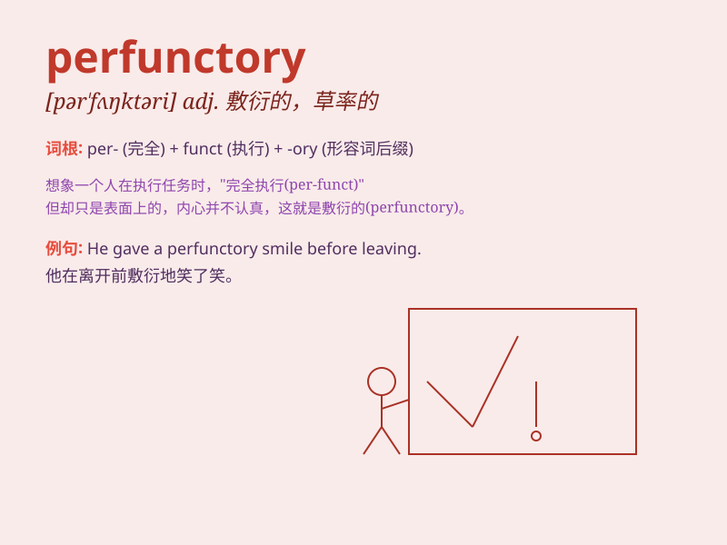

## perfunctory

**英音:** _[pə\'fʌŋ(k)t(ə)rɪ]_ **美音:**
_[pɚ\'fʌŋktəri]_

**译义:** *adj.马马虎虎的*

### 短语

+ **perfunctory effort:** _敷衍的努力_

+ **perfunctory answer:** _敷衍的回答_

+ **perfunctory greeting:** _敷衍的问候_

+ **perfunctory inspection:** _敷衍的检查_

+ **perfunctory smile:** _敷衍的微笑_

### 例句

#### 例句1

> **He gave a perfunctory nod and continued working.**

**中文翻译:** 他敷衍地点了点头，继续工作。

**单词释义:** 敷衍的

#### 例句2

> **The perfunctory response from the customer service was not
satisfactory.**

**中文翻译:** 客服敷衍的回复不能令人满意。

**单词释义:** 敷衍的；马虎的

#### 例句3

> **She made a perfunctory attempt to clean the room.**

**中文翻译:** 她敷衍地尝试打扫房间。

**单词释义:** 敷衍的；草率的

### 背诵小故事

> A worker named Tom always did his tasks perfunctorily. He just went
through the motions without putting in real effort. One day, he was
criticized for his poor performance. From then on, he realized the
importance of being sincere and stopped being perfunctory.

**有个叫汤姆的工人总是敷衍地做他的工作。他只是走过场，没有真正努力。有一天，他因表现不佳受到批评。从那以后，他意识到真诚的重要性，不再敷衍了事。**

### 图义

