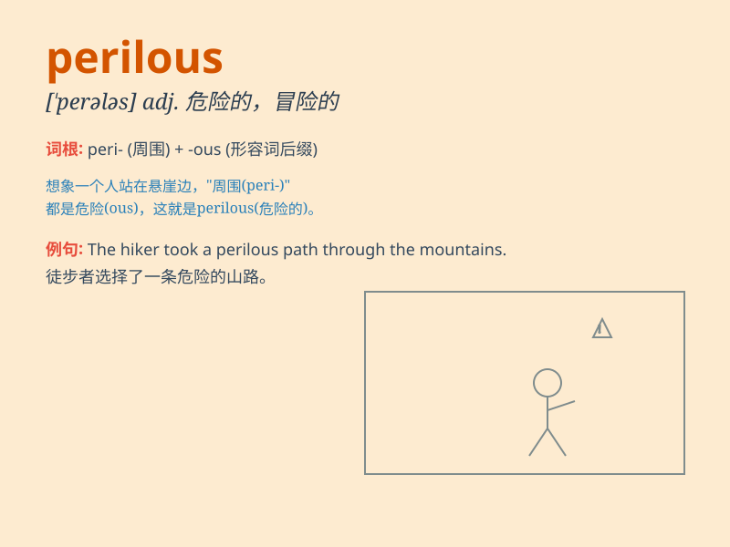

## perilous

**英音:** _[\'perɪləs]_ **美音:** _[\'pɛrələs]_

**译义:** *adj.危险的*

### 短语

+ **perilous journey:** _危险的旅程_

+ **perilous situation:** _危险的情况_

+ **perilous adventure:** _危险的冒险_

+ **perilous path:** _危险的道路_

+ **perilous task:** _危险的任务_

### 例句

#### 例句1

> **The mountain road was perilous, with sharp turns and steep
drops.**

**中文翻译:** 这条山路很危险，有急转弯和陡峭的落差。

**单词释义:** 危险的

#### 例句2

> **He embarked on a perilous journey across the desert alone.**

**中文翻译:** 他独自踏上了穿越沙漠的危险旅程。

**单词释义:** 危险的

#### 例句3

> **The situation in the war zone was perilous for civilians.**

**中文翻译:** 战区的局势对平民来说是危险的。

**单词释义:** 危险的

### 背诵小故事

> A brave adventurer was on a perilous journey. He had to cross a deep
canyon and climb a steep mountain. Every step was full of danger, but he
didn\'t give up. \'Perilous\' means full of danger or very risky.

**一位勇敢的冒险家正在进行一次危险的旅程。他必须穿过一个深谷，爬上陡峭的山峰。每一步都充满危险，但他没有放弃。'perilous'意思是充满危险的或非常冒险的。**

### 图义

