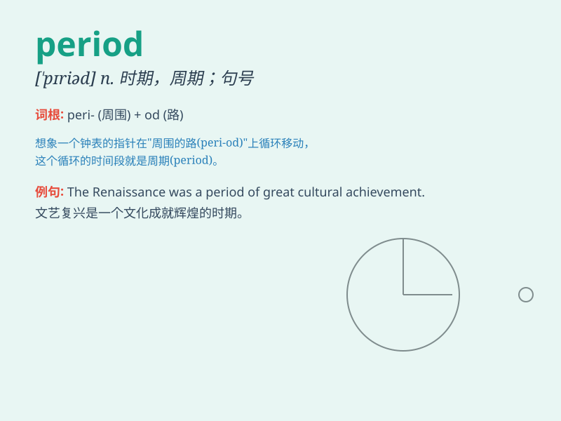

## period

**英音:** _[\'pɪərɪəd]_ **美音:** _[\'pɪrɪəd]_

**译义:**
*n.时期,学时,节,句点,周期,(妇女的)经期adj.过去某段时期的int.没有了*

### 短语

+ **period of time:** _一段时间；时期_

+ **menstrual period:** _月经期；生理期_

+ **historical period:** _历史时期_

+ **trial period:** _试用期；试验期_

+ **recovery period:** _恢复期_

### 例句

#### 例句1

> **The dinosaurs died out over a long period of time.**

**中文翻译:** 恐龙在很长一段时间内灭绝了。

**单词释义:** 一段时间；时期

#### 例句2

> **She has a period of rest every afternoon.**

**中文翻译:** 她每天下午都有一段休息时间。

**单词释义:** 一段时间；期间

#### 例句3

> **Women have a monthly period.**

**中文翻译:** 女性每月有生理期。

**单词释义:** 生理期；月经

### 背诵小故事

> A princess was trapped in a castle for a long period. She waited and
waited, until one day, a brave knight came to rescue her. This long wait
was like a period of darkness for her.

**一位公主被困在城堡里很长一段时间。她等啊等，直到有一天，一位勇敢的骑士来救她。这段漫长的等待对她来说就像一段黑暗的时期。**

### 图义

