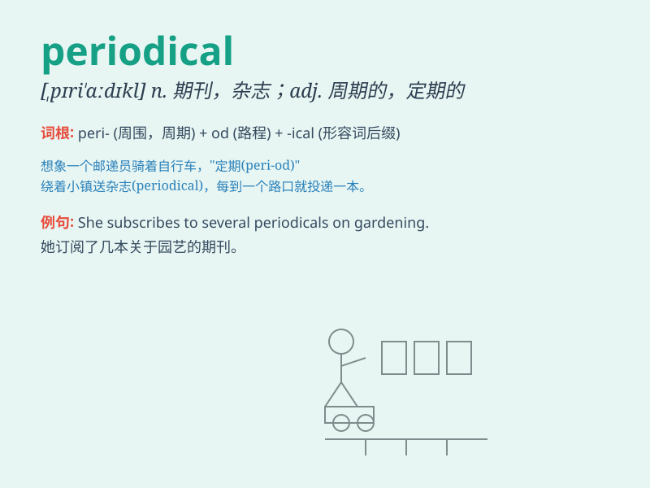

## periodical

**英音:** _[pɪərɪ\'ɒdɪk(ə)l]_ **美音:** _[,pɪrɪ\'ɑdɪkl]_

**译义:** *adj.周期的,定期的n.期刊,杂志*

### 短语

+ **periodical inspection:** _定期检查_

+ **periodical publication:** _期刊出版物_

+ **periodical review:** _定期审查_

+ **periodical report:** _定期报告_

+ **periodical maintenance:** _定期维护_

### 例句

#### 例句1

> **I enjoy reading periodical magazines about science and
technology.**

**中文翻译:** 我喜欢阅读有关科技的期刊杂志。

**单词释义:** 期刊；杂志

#### 例句2

> **The library subscribes to various periodical publications.**

**中文翻译:** 图书馆订阅了各种定期出版的刊物。

**单词释义:** 定期出版物

#### 例句3

> **Periodical inspections are necessary to ensure the safety of the
equipment.**

**中文翻译:** 定期检查对于确保设备的安全是必要的。

**单词释义:** 定期的；周期的

### 背诵小故事

>
想象一个记者，他总是按照固定的周期（period）写报道。他的这些报道被整理成了一本期刊（periodical）。每次新的一期出来，大家都迫不及待地阅读。

**想象一位记者按照固定周期写报道，其报道整理成的期刊，大家期待阅读的故事**

### 图义

