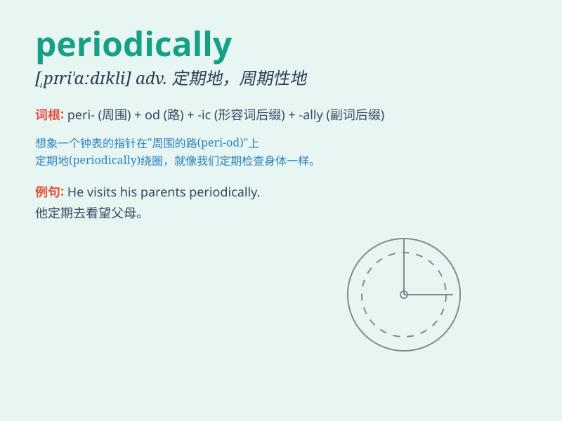

## periodically

**英音:** _[,pɪərɪ\'ɒdɪkəlɪ]_ **美音:** _[pɪrɪˈɑdɪklɪ]_

**译义:** *adv.周期性地,定时性地*

### 短语

+ **periodically review:** _定期审查_

+ **periodically update:** _定期更新_

+ **periodically check:** _定期检查_

+ **periodically monitor:** _定期监测_

+ **periodically assess:** _定期评估_

### 例句

#### 例句1

> **The machine is checked periodically to ensure its proper
functioning.**

**中文翻译:** 这台机器会定期接受检查以确保其正常运行。

**单词释义:** 定期地

#### 例句2

> **We need to update the data periodically to keep it accurate.**

**中文翻译:** 我们需要定期更新数据以保持其准确性。

**单词释义:** 定期地

#### 例句3

> **The company\'s financial reports are published periodically for
shareholders.**

**中文翻译:** 公司的财务报告定期为股东发布。

**单词释义:** 定期地

### 背诵小故事

> A brave knight had to check the castle\'s defense periodically. Every
time he did, he made sure everything was safe. Just like the knight\'s
checks, \'periodically\' means at regular intervals or from time to
time.

**一位勇敢的骑士必须定期检查城堡的防御。每次他这么做，都能确保一切安全。就像骑士的检查一样，'periodically'意思是定期地，周期性地，不时地。**

### 图义

