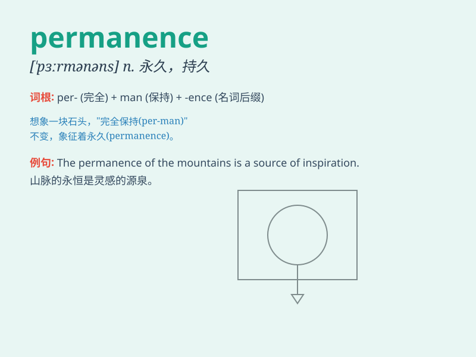

## permanence

**英音:** _[\'pɜːmənəns]_ **美音:** _[\'pɝmənəns]_

**译义:** *n.永久,持久*

### 短语

+ **permanence of memory:** _记忆的持久性_

+ **relative permanence:** _相对的永久性_

+ **ensure permanence:** _确保永久性_

+ **lack of permanence:** _缺乏永久性_

+ **the permanence of love:** _爱情的永恒_

### 例句

#### 例句1

> **The permanence of the building is remarkable.**

**中文翻译:** 这座建筑的持久性令人瞩目。

**单词释义:** 持久性

#### 例句2

> **She was seeking permanence in a changing world.**

**中文翻译:** 她在不断变化的世界中寻求永恒。

**单词释义:** 永恒；永久性

#### 例句3

> **The artist aimed to convey a sense of permanence through his
work.**

**中文翻译:** 这位艺术家旨在通过他的作品传达一种永恒感。

**单词释义:** 永久性；持久不变

### 背诵小故事

> A king desired permanence of his kingdom. He built strong castles and
made wise laws. But he learned that true permanence comes from the love
and loyalty of his people. So, \'permanence\' means lasting forever or
being permanent.

**一位国王渴望他的王国永存。他建造了坚固的城堡，制定了明智的法律。但他明白真正的永恒来自于人民的爱和忠诚。所以，\'permanence\'意思是永远持续或永恒不变。**

### 图义

