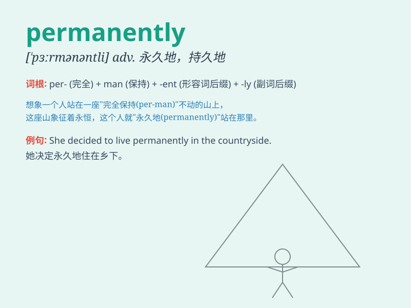

## permanently

**英音:** _[\'pɜːm(ə)nəntlɪ]_ **美音:** _[\'pɝmənəntli]_

**译义:** *adv.永存地,不变地*

### 短语

+ **permanently closed:** _永久关闭_

+ **permanently disabled:** _永久残疾_

+ **permanently employed:** _长期雇用_

+ **permanently damaged:** _永久损坏_

+ **permanently attached:** _永久附着_

### 例句

#### 例句1

> **She has permanently moved to another country.**

**中文翻译:** 她已经永久地搬到了另一个国家。

**单词释义:** 永久地

#### 例句2

> **The damage to his reputation was permanently irreversible.**

**中文翻译:** 对他声誉的损害是永久性的、不可逆转的。

**单词释义:** 永久性地

#### 例句3

> **The company has permanently closed down the factory.**

**中文翻译:** 这家公司已经永久地关闭了工厂。

**单词释义:** 永久地

### 背诵小故事

> A little bird wanted to build a nest permanently in a big tree. But
the tree was not stable. Finally, it found a safe place and had a
permanent home. The bird was happy.

**一只小鸟想在一棵大树上永久地筑巢。但这棵树不稳固。最后，它找到了一个安全的地方，有了一个永久性的家。小鸟很高兴。**

### 图义

