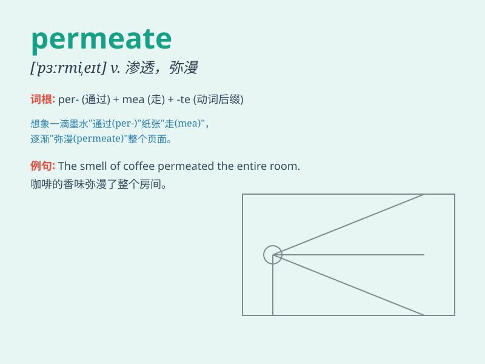

## permeate

**英音:** _[\'pɜːmɪeɪt]_ **美音:** _[\'pɝmɪet]_

**译义:** *vt.弥漫,渗透,透过,充满vi.透入*

### 短语

+ **permeate through:** _渗透穿过_

+ **permeate into:** _渗入；渗透进_

+ **permeate with:** _充满；弥漫着_

+ **be permeated by:** _被\...\...渗透_

+ **permeate throughout:** _遍布；弥漫于_

### 例句

#### 例句1

> **The smell of fresh coffee permeated the room.**

**中文翻译:** 新鲜咖啡的气味弥漫了整个房间。

**单词释义:** 弥漫；充满

#### 例句2

> **Water can permeate through the soil easily.**

**中文翻译:** 水能够轻易地渗透过土壤。

**单词释义:** 渗透；透过

#### 例句3

> **A sense of optimism permeated the team after the victory.**

**中文翻译:** 胜利后，乐观的情绪在团队中蔓延开来。

**单词释义:** 蔓延；扩散

### 背诵小故事

>
想象一下，有一个神奇的魔法药水，它能够慢慢穿过每一个缝隙，进入到城堡的每一个角落。这个药水的行为就像\'permeate\'这个单词所表达的，不断渗透、弥漫。

**想象魔法药水渗透城堡的情景来辅助记忆\'permeate\'（渗透、弥漫）这个单词**

### 图义

