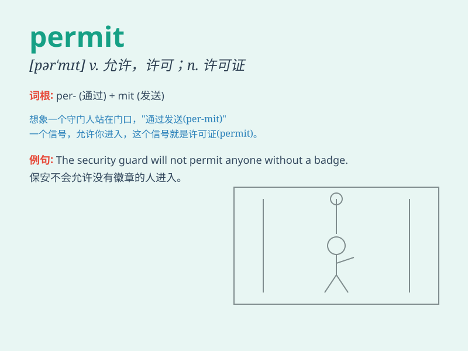

## permit

**英音:** _[pə\'mɪt]_ **美音:** _[pɚ\'mɪt]_

**译义:** *n.通行证,许可证,执照v.许可,允许,准许*

### 短语

+ **permit of:** _容许；有...的可能_

+ **entry permit:** _入境许可证_

+ **work permit:** _工作许可证_

+ **export permit:** _出口许可证_

+ **permit sb. to do sth.:** _允许某人做某事_

### 例句

#### 例句1

> **You are not permitted to smoke in this room.**

**中文翻译:** 在这个房间里你不被允许吸烟。

**单词释义:** 允许；许可

#### 例句2

> **The rules of the club do not permit alcohol.**

**中文翻译:** 这个俱乐部的规定不允许饮酒。

**单词释义:** 准许；允许

#### 例句3

> **I\'ll come tomorrow, weather permitting.**

**中文翻译:** 如果天气允许，我明天来。

**单词释义:** 使有可能；使成为可能

### 背诵小故事

> A man wanted to enter a restricted area. He applied for a permit.
After a careful check, the guard permitted him to go in. With the
permit, he had the right to access the place.

**一个男人想进入一个限制区域。他申请了许可证。经过仔细检查，守卫允许他进去。有了许可证，他就有权进入这个地方。**

### 图义

