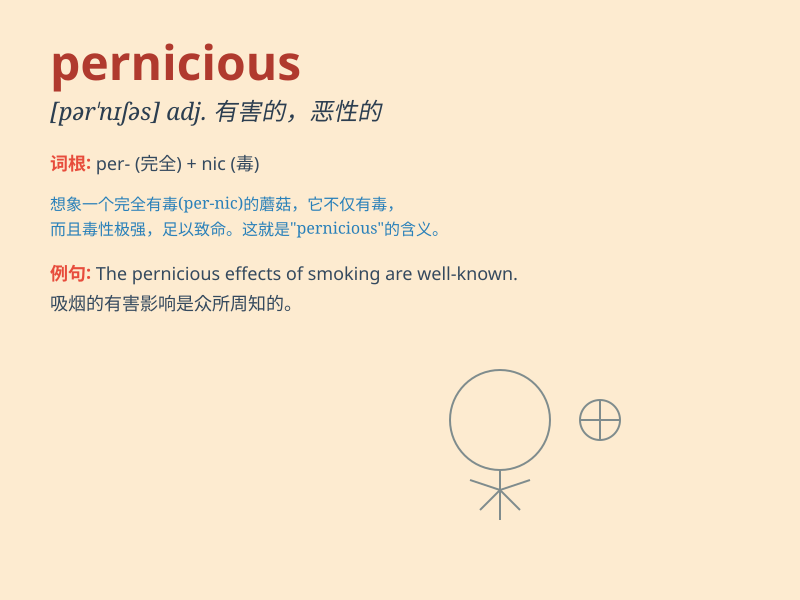

## pernicious

**英音:** _[pə\'nɪʃəs]_ **美音:** _[pɚ\'nɪʃəs]_

**译义:** *adj.有害的*

### 短语

+ **pernicious anemia:** _恶性贫血_

+ **pernicious influence:** _有害的影响_

+ **pernicious habit:** _不良习惯；有害的习惯_

+ **pernicious cycle:** _恶性循环_

+ **pernicious trend:** _有害的趋势_

### 例句

#### 例句1

> **The pernicious effects of smoking on health are well-known.**

**中文翻译:** 吸烟对健康的有害影响是众所周知的。

**单词释义:** 有害的

#### 例句2

> **Pernicious rumors can spread quickly and cause a lot of
damage.**

**中文翻译:** 有害的谣言可以迅速传播并造成很大的破坏。

**单词释义:** 有害的

#### 例句3

> **The pernicious influence of bad company can lead one astray.**

**中文翻译:** 不良伙伴的有害影响会使人误入歧途。

**单词释义:** 有害的

### 背诵小故事

> A pernicious virus spread in the small town. It was so harmful that
many people got sick. But a brave doctor worked hard to stop it and save
the town. Remember, pernicious means extremely harmful or evil.

**一种有害的病毒在小镇上传播。它的危害极大，许多人都生病了。但一位勇敢的医生努力工作来阻止它并拯救了小镇。记住，pernicious
意思是极其有害的或邪恶的。**

### 图义

