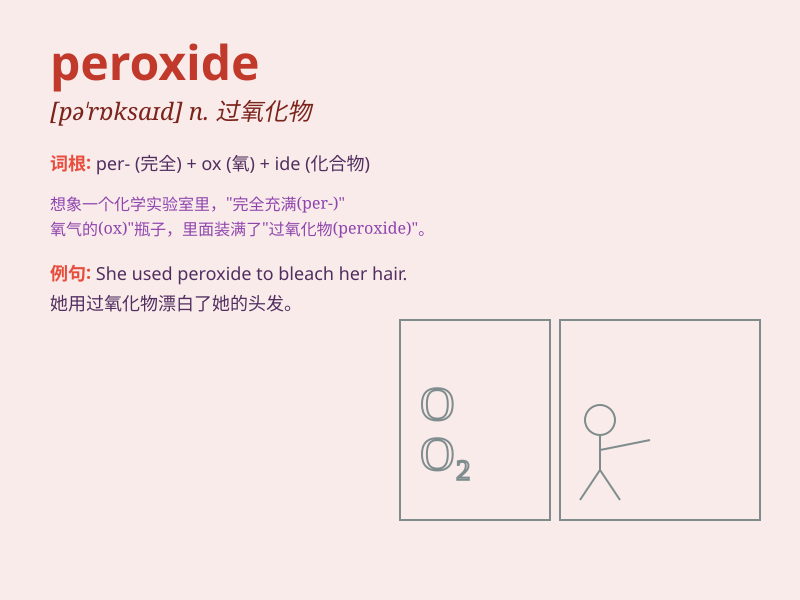

## peroxide

**英音:** _[pə\'rɒksaɪd]_ **美音:** _[pə\'rɑksaɪd]_

**译义:** *n.[化]过氧化物,过氧化氢v.以过氧化氢漂白*

### 短语

+ **hydrogen peroxide:** _过氧化氢；双氧水_

+ **benzoyl peroxide:** _过氧化苯甲酰_

+ **peroxide value:** _过氧化值_

+ **peroxide bleaching:** _过氧化物漂白_

+ **organic peroxide:** _有机过氧化物_

### 例句

#### 例句1

> **Hydrogen peroxide is often used as a disinfectant.**

**中文翻译:** 过氧化氢常被用作消毒剂。

**单词释义:** 过氧化氢

#### 例句2

> **She accidentally spilled peroxide on her new dress.**

**中文翻译:** 她不小心把过氧化氢洒在新裙子上了。

**单词释义:** 过氧化氢

#### 例句3

> **The chemist mixed some peroxide with other substances in the
experiment.**

**中文翻译:** 这位化学家在实验中把一些过氧化氢和其他物质混合起来。

**单词释义:** 过氧化氢

### 背诵小故事

>
有一天，小明在实验室里看到一瓶标有\'peroxide\'的液体。老师告诉他这是过氧化氢，能用于消毒和漂白。小明记住了\'peroxide\'这个单词，因为它是那种有强大清洁能力的神奇液体。

**有一天，小明在实验室看到标有"过氧化
氢"的液体。老师说它能消毒和漂白，小明因此记住了这个单词，因为它是有强大清洁能力的神奇液体。**

### 图义

