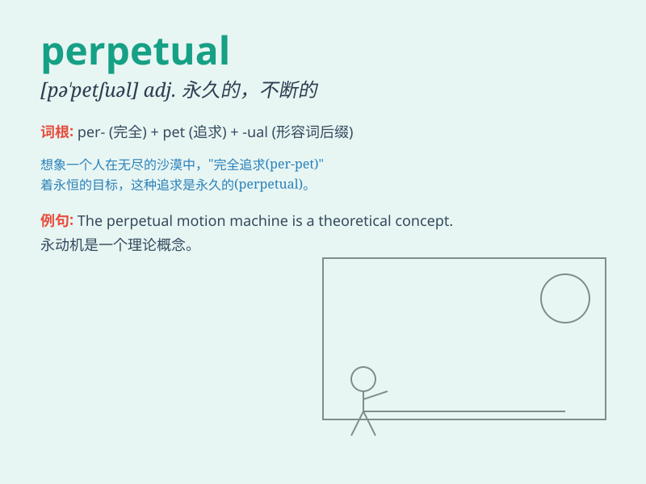

## perpetual

**英音:** _[pə\'petʃʊəl; -tjʊəl]_ **美音:**
_[pɚ\'pɛtʃuəl]_

**译义:** *adj.永久的*

### 短语

+ **perpetual motion:** _永恒运动_

+ **perpetual calendar:** _万年历_

+ **perpetual student:** _终身学习者_

+ **perpetual lease:** _永久租赁_

+ **perpetual peace:** _永久和平_

### 例句

#### 例句1

> **The machine requires perpetual maintenance to function
properly.**

**中文翻译:** 这台机器需要持续的维护才能正常运行。

**单词释义:** 持续的

#### 例句2

> **She was tired of his perpetual complaints.**

**中文翻译:** 她厌倦了他没完没了的抱怨。

**单词释义:** 没完没了的

#### 例句3

> **The garden was filled with perpetual flowers throughout the
year.**

**中文翻译:** 这个花园一年四季都开满了常开不败的花。

**单词释义:** 常开不败的

### 背诵小故事

> A young artist was always seeking the perpetual beauty of nature. He
traveled far and wide, never stopping, determined to capture its essence
in his paintings. This unending pursuit was his perpetual passion.

**一位年轻的艺术家一直在追寻大自然永恒的美。他四处游历，从不停歇，决心在他的画作中捕捉其精髓。这种永不停息的追求是他永恒的激情。**

### 图义

