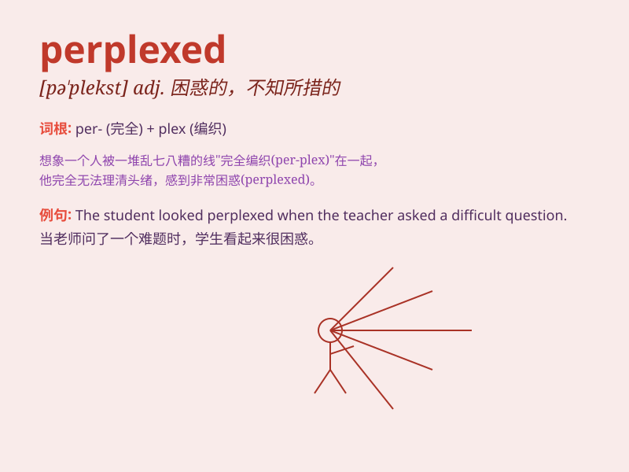

## perplexed

**英音:** _[pə\'plekst]_ **美音:** _[pɚ\'plɛkst]_

**译义:** *adj.困惑的,不知所措的*

### 短语

+ **be perplexed at:** _对\...\...感到困惑_

+ **perplexed look:** _困惑的表情_

+ **feel perplexed:** _感到困惑_

+ **perplexed state:** _困惑的状态_

+ **perplexed mind:** _困惑的头脑_

### 例句

#### 例句1

> **She looked perplexed by the complex math problem.**

**中文翻译:** 她看起来被这道复杂的数学题难住了。

**单词释义:** 困惑的；不知所措的

#### 例句2

> **He was perplexed at her sudden decision to leave.**

**中文翻译:** 他对她突然决定离开感到困惑。

**单词释义:** 感到困惑的；迷惑不解的

#### 例句3

> **The perplexed tourist asked for directions several times.**

**中文翻译:** 这位困惑的游客多次询问方向。

**单词释义:** 困惑的；茫然的

### 背诵小故事

> One day, Tom found a mysterious box. The symbols and clues on it
perplexed him. He spent hours trying to figure it out but still felt
confused and unsure. Finally, he decided to seek help.

**一天，汤姆发现了一个神秘的盒子。上面的符号和线索让他感到困惑。他花了几个小时试图弄明白，但仍然感到迷茫和不确定。最后，他决定寻求帮助。**

### 图义

