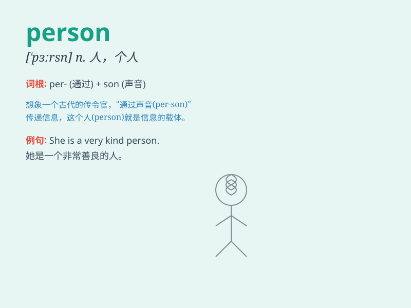

## person

**英音:** _[\'pɜːs(ə)n]_ **美音:** _[\'pɝsn]_

**译义:** *n.人,身体,容貌,[语法]人称*

### 短语

+ **in person:** _亲自；亲身_

+ **the person concerned:** _有关人士；当事人_

+ **a person of influence:** _有影响力的人_

+ **a person of means:** _有钱人；富有的人_

+ **person to person:** _个人对个人；一对一_

### 例句

#### 例句1

> **She is a kind person.**

**中文翻译:** 她是一个善良的人。

**单词释义:** 人；个人

#### 例句2

> **The person in the photo is my father.**

**中文翻译:** 照片里的那个人是我父亲。

**单词释义:** 人

#### 例句3

> **He is a very interesting person.**

**中文翻译:** 他是一个非常有趣的人。

**单词释义:** 人；个人

### 背诵小故事

> One day, a little boy was lost in a big city. A kind person helped
him find his way home. The person had a warm smile and a caring heart.
The boy will always remember this nice person.

**有一天，一个小男孩在大城市里迷路了。一位善良的人帮助他找到了回家的路。这个人有着温暖的笑容和关爱的心。这个男孩将永远记住这位好心人。**

### 图义

