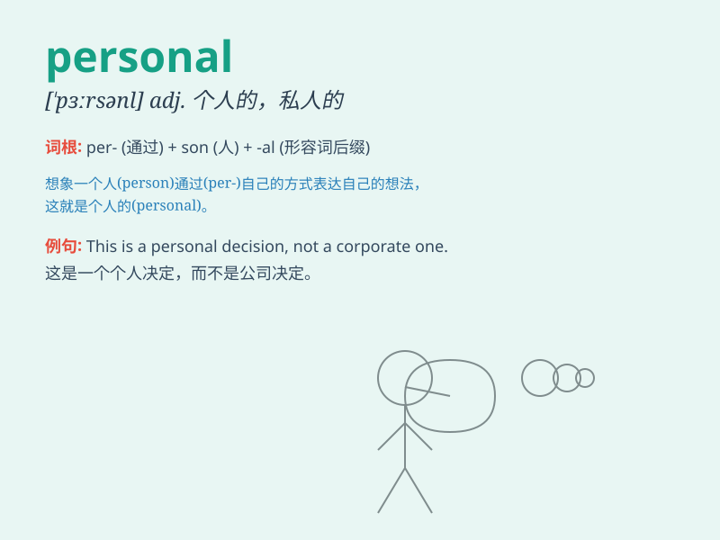

## personal

**英音:** _[\'pɜːs(ə)n(ə)l]_ **美音:** _[\'pɝsənl]_

**译义:**
*adj.私人的,个人的,亲自的,容貌的,身体的,人身的,针对个人的adj.[语法]人称的*

### 短语

+ **personal information:** _个人信息_

+ **personal experience:** _个人经历_

+ **personal belongings:** _个人物品_

+ **personal development:** _个人发展_

+ **personal relationship:** _个人关系_

### 例句

#### 例句1

> **My personal opinion is that we should wait and see.**

**中文翻译:** 我的个人意见是我们应该等等看。

**单词释义:** 个人的

#### 例句2

> **She has a very personal style of dressing.**

**中文翻译:** 她有着非常个性化的穿着风格。

**单词释义:** 个人的；私人的

#### 例句3

> **This is a personal matter and I don\'t want to discuss it in
public.**

**中文翻译:** 这是私人事务，我不想在公共场合讨论。

**单词释义:** 私人的

### 背诵小故事

> One day, Tom received a personal letter. It was written just for him
and had special messages. This made him feel unique and important.
\'Personal\' means belonging to or relating to a particular person.

**一天，汤姆收到了一封私人信件。这封信只为他而写，有着特别的信息。这让他感觉独特且重要。'personal'意思是属于或关于某一个特定的人的。**

### 图义

