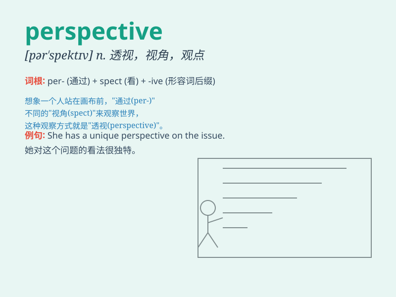

## perspective

**英音:** _[pə\'spektɪv]_ **美音:** _[pɚ\'spɛktɪv]_

**译义:** *n.透视画法,透视图,远景,前途,观点,看法,观点,观察*

### 短语

+ **in perspective:** _正确地；客观地；全面地_

+ **get sth. into perspective:** _正确看待某事_

+ **keep sth. in perspective:** _客观地看待某事_

+ **a perspective on sth.:** _对某事的看法；观察某事的视角_

+ **from a different perspective:** _从不同的角度_

### 例句

#### 例句1

> **From a historical perspective, this event was of great
significance.**

**中文翻译:** 从历史的角度来看，这个事件具有重大意义。

**单词释义:** 角度；观点

#### 例句2

> **It\'s important to consider problems from multiple
perspectives.**

**中文翻译:** 从多个角度考虑问题是很重要的。

**单词释义:** 角度；方面

#### 例句3

> **The artist\'s work offers a unique perspective on modern
life.**

**中文翻译:** 这位艺术家的作品为现代生活提供了独特的视角。

**单词释义:** 视角；看法

### 背诵小故事

>
想象你站在山顶，眼前的美景让你对世界有了全新的看法。这种从特定位置看到的景象就像\'perspective\'，它代表着观点、视角。就像站在山顶，你的perspective
变得独特而清晰。

**想象你站在山顶看到的景象来理解perspective这个单词，它意思是观点、视角**

### 图义

