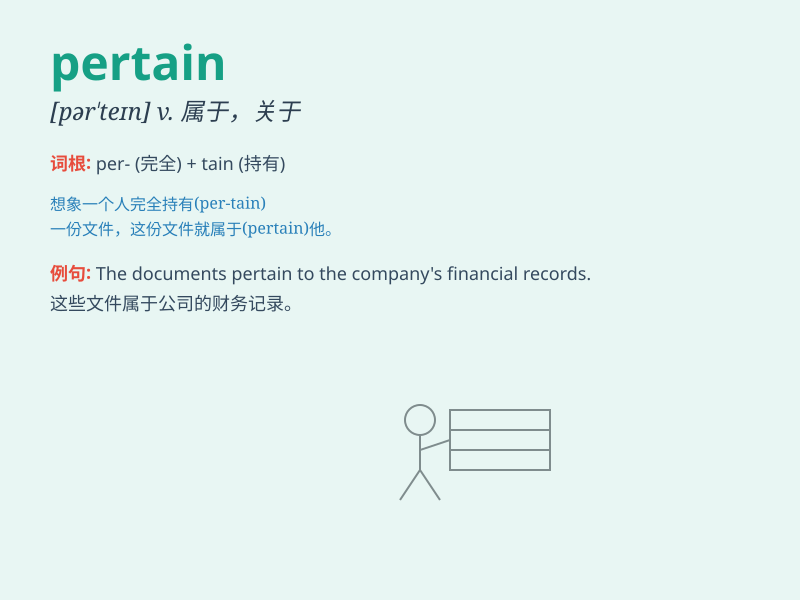

## pertain

**英音:** _[pə\'teɪn]_ **美音:** _[pɝ\'ten]_

**译义:** *v.适合,属于*

### 短语

+ **pertain to:** _属于；关于；适用于_

+ **pertain directly:** _直接相关_

+ **pertain closely:** _密切相关_

+ **pertain particularly:** _特别相关_

+ **pertain generally:** _一般相关_

### 例句

#### 例句1

> **The rules pertaining to this competition are very strict.**

**中文翻译:** 与这场比赛有关的规则非常严格。

**单词释义:** 与\...\...有关；适用于

#### 例句2

> **His remarks did not pertain to the topic at hand.**

**中文翻译:** 他的言论与手头的话题无关。

**单词释义:** 与\...\...相关

#### 例句3

> **The documents pertain to the company\'s financial situation last
year.**

**中文翻译:** 这些文件涉及公司去年的财务状况。

**单词释义:** 涉及；有关

### 背诵小故事

> A king\'s power pertains to ruling the kingdom. But when he becomes
too selfish, the people rebel. So, pertain means to be related to or
have a connection with.

**一位国王的权力与统治王国有关。但当他变得太自私时，人民就会反抗。所以，pertain
意思是与......有关或有联系。**

### 图义

