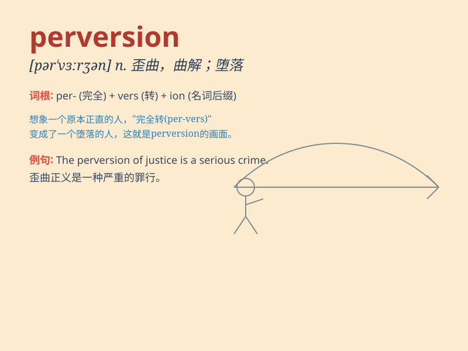

## perversion

**英音:** _[pəˈvɜːʃn]_ **美音:** _[pərˈvɜːrʒn]_

**译义:** *n.颠倒,曲解*

### 短语

+ **sexual perversion:** _性变态_

+ **perversion of justice:** _司法的扭曲_

+ **perversion of truth:** _对真理的歪曲_

+ **perversion of history:** _历史的曲解_

+ **perversion of values:** _价值观的扭曲_

### 例句

#### 例句1

> **The crime was a perversion of justice.**

**中文翻译:** 这一罪行是对正义的歪曲。

**单词释义:** 歪曲；曲解

#### 例句2

> **His perversion of the facts was obvious.**

**中文翻译:** 他对事实的歪曲是显而易见的。

**单词释义:** 扭曲；篡改

#### 例句3

> **The perversion of her innocent mind was a tragedy.**

**中文翻译:** 她纯真心灵的堕落是一场悲剧。

**单词释义:** 堕落；败坏

### 背诵小故事

> A detective was investigating a strange case. The culprit\'s actions
were a perversion of justice. He twisted the facts and caused chaos. But
in the end, the detective exposed this perversion and restored truth.

**一位侦探正在调查一个奇怪的案子。罪犯的行为是对正义的歪曲。他扭曲事实并制造混乱。但最终，侦探揭露了这种歪曲并恢复了真相。**

### 图义

